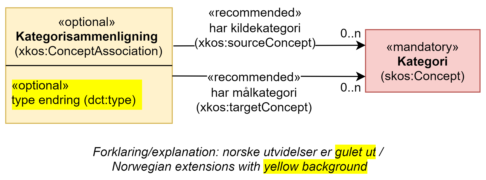

== Klassen Kategorisammenligning (xkos:ConceptAssociation) [[Kategorisammenligning]]

[[img-KlassenKategorisammenligning]]
.Klassen Kategorisammenligning (xkos:ConceptAssociation) og klassen den refererer til.
[link=images/KlassenKategorisammenligning.png]

[cols="30s,70d"]
|===
|English name |Category correspondence
|Beskrivelse |Brukes til å representere sammenligning mellom kategorier.
|Usage note |To represent correspondences between classification items.
|URI|xkos:ConceptAssociation
|Kravsnivå |Valgfri/Optional
|Merknad |
|Eksempel |Sammenligning mellom kategorien «1.11 – Produksjon av elektroniske komponenter og kretskort» i «Klassifisering av informasjonssektoren 2007» (målkategori), og kategorien «26.1 – Produksjon av elektroniske komponenter og kretskort» i «Næringsgruppering 2007 (SN 2007)» (kildekategori).
|===

Eksempel i RDF Turtle:
----
<261vs111> a xkos:ConceptAssociation ;
   xkos:sourceConcept <sn2007-261> ;
   xkos:targetConcept <snInfo2007-111> ; .

<snInfo2007-111> a skos:Concept ;
   skos:prefLabel "Produksjon av elektroniske komponenter og kretskort"@nb ;
   skos:inScheme <snInfo2007> ; .

<sn2007-261> a skos:Concept ;
   skos:prefLabel "Produksjon av elektroniske komponenter og kretskort"@nb ;
   skos:inScheme <sn2007> ; .

<1102n1129vs1108> a xkos:ConceptAssociation ;
   xkos:targetConcept <1108> ;
   xkos:sourceConcept <1102> , <1129> ; .

<1108> a skos:Concept ;
   skos:prefLabel "Sandnes"@nb ;
   skos:notation "1108" ;
   skos:inScheme <kommuneinndeling2020> ; .

<1102> a skos:Concept ;
   skos:prefLabel "Sandnes"@nb ;
   skos:notation "1102" ;
   skos:inScheme <kommuneinndeling2019> ; .

<1102> a skos:Concept ;
   skos:prefLabel "Forsand"@nb ;
   skos:notation "1129" ;
   skos:inScheme <kommuneinndeling2019> ; .
----

=== Anbefalte egenskaper for klassen _Kategorisammenligning_ [[Kategorisammenligning-anbefalte-egenskaper]]

==== Kategorisammenligning – har kildekategori (xkos:sourceConcept) [[Kategorisammenligning-harKildekategori]]

[cols="30s,70d"]
|===
|English name |source category
|URI |xkos:sourceConcept
|Range |skos:Concept
|Beskrivelse |Brukes til å referere til en kildekategori i en kategorisammenligning.
|Usage note |To link to a source concept in the correspondence.
|Multiplisitet |0..n
|Kravsnivå |Anbefalt/Recommended
|Merknad |
|Eksempel |Se eksemplet under beskrivelsen av denne klassen i begynnelsen av dette kapittelet.
|===

Eksempel i RDF Turtle: Se eksemplet under beskrivelsen av denne klassen i begynnelsen av dette kapittelet.

==== Kategorisammenligning – har målkategori (xkos:targetConcept) [[Kategorisammenligning-harMålkategori]]

[cols="30s,70d"]
|===
|English name |target category
|URI |xkos:targetConcept
|Range |skos:Concept
|Beskrivelse |Brukes til å referere til en målkategori i en kategorisammenligning.
|Usage note |To link to a target concept in the correspondence.
|Multiplisitet |0..n
|Kravsnivå |Anbefalt/Recommended
|Merknad |
|Eksempel | Se eksemplet under beskrivelsen av denne klassen i begynnelsen av dette kapittelet.
|===

Eksempel i RDF Turtle: Se eksemplet under beskrivelsen av denne klassen i begynnelsen av dette kapittelet.

=== Valgfrie egenskaper for klassen _Kategorisammenligning_ [[Kategorisammenligning-valgfrie-egenskaper]]

==== Kategorisammenligning – type endring (dct:type) [[Kategorisammenligning-typeEndring]]

[cols="30s,70d"]
|===
|English name |change type
|URI |dct:type
|Range |skos:Concept
|Beskrivelse |Brukes til å oppgi type endring mellom to klassifikasjoner i samme klassifikasjonsfamilie/-serie.
|Usage note |To specify the type of the change between two classifications in the same classification family/series.
|Multiplisitet |0..1
|Kravsnivå |Valgfri/Optional
|Merknad 1 |Verdien skal velges fra det felles kontrollerte vokabularet https://data.norge.no/vocabulary/classification-item-change-type[Kategoriendringstyper], når verdien finnes i vokabularet.
|Remark 1 | The value shall be chosen from the common controlled vocabulary https://data.norge.no/vocabulary/classification-item-change-type[Classification item change types], when the value is in the vocabulary.
|Merknad 2 |Norsk utvidelse: ikke eksplisitt tatt med i XKOS. 
|Remark 2 | Norwegian extension: Not explicitly specified in XKOS.
|Eksempel |Se https://www.ssb.no/klass/klassifikasjoner/6/endringer[https://www.ssb.no/klass/klassifikasjoner/6/endringer] fra SN2002 til SN2007
|===

Eksempel i RDF Turtle:
----
<nil90035> a xkos:ConceptAssociation ;
 xkos:targetConcept <sn2007-90035> ; # en målkategori og ingen kildekategori
  dct:type <https://data.norge.no/vocabulary/classification-item-change-type#creation> ; # oppretting
  .

<01210vs01410n01420> a xkos:ConceptAssociation ;
   xkos:sourceConcept <sn2002-01210> ; # en kildekategori
   xkos:tagetConcept <sn2007-01410> , <sn2007-01420> # to målkategorier
  dct:type <https://data.norge.no/vocabulary/classification-item-change-type#breakdown> ; # oppsplitting
  .
----
