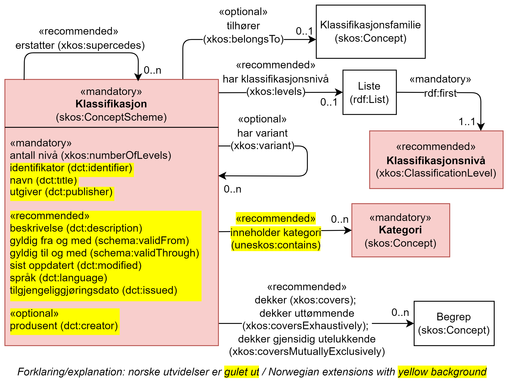

== Klassen Klassifikasjon (skos:ConceptScheme) [[Klassifikasjon]]

[[img-KlassenKlassifikasjon]]
.Klassen Klassifikasjon (skos:ConceptScheme) og klassene den refererer til.
[link=images/KlassenKlassifikasjon.png]

[cols="30s,70d"]
|===
|__English name__ |__Classification__
|Anvendelse / __Usage note__ | (norsk) Klassen brukes til å representere en klassifikasjon, en variant eller en versjon av en klassifikasjon.

__(English) This class is used to represent a classification, a variant of a version of a classification.__
|URI |skos:ConceptScheme
|Kravnivå / __Requirement level__ | Obligatorisk / __Mandatory__
|Merknad / __Note__ | (norsk) I konteksten av dette dokumentet er en gitt variant/versjon av en klassifikasjon også en klassifikasjon.

__(English) In the context of this document, a given variant/version of a classification is also a classification.__
|Eksempel |Næringsgruppering 2007 (SN 2007)
|===

Eksempel i RDF Turtle:
----
<sn2007> a skos:ConceptScheme ;
   skos:prefLabel "Næringsgruppering 2007"@nb ;
   xkos:belongsTo <sn> .

<sn> a skos:Concept ;
   skos:prefLabel "Standard for næringsgruppering"@nb ; .
----

=== Obligatoriske egenskaper for klassen _Klassifikasjon_ [[Klassifikasjon-obligatoriske-egenskaper]]

==== Klassifikasjon – antall nivåer (xkos:numberOfLevels) [[Klassifikasjon-antallNivåer]]

[cols="30s,70d"]
|===
|__English name__ |__number of levels__
|URI |xkos:numberOfLevels
|Range |rdfs:Literal typed as xsd:positiveInteger
|Anvendelse / __Usage note__ | (norsk) Egenskapen brukes til å oppgi antall nivåer i klassifikasjonen; 1 for en flat klassifikasjon.

__(English) This property is used to document number of levels the classification includes; 1 for a flat classification.__
|Multiplisitet |1..1
|Kravnivå / __Requirement level__ | Obligatorisk / __Mandatory__
|Eksempel |«Næringsgruppering 2007» har totalt fem nivåer.
|===

Eksempel i RDF Turtle:
----
<sn2017> a skos:ConceptScheme ;
   xkos:numberOfLevels "5"^^xsd:positiveInteger .

----

==== Klassifikasjon – identifikator (dct:identifier) [[Klassifikasjon-identifikator]]

[cols="30s,70d"]
|===
|__English name__ |__identifier__
|URI |dct:identifier
|Range |rdfs:Literal typed as xsd:anyURI
|Anvendelse / __Usage note__ | (norsk) Egenskapen brukes til å oppgi identifikatoren til klassifikasjonen.

__(English) This property is used to refer to the identifier of the classification.__
|Multiplisitet |1..1
|Kravnivå / __Requirement level__ | Obligatorisk / __Mandatory__
|Merknad / __Note 1__ | (norsk) Identifikator er som regel systemgenerert av verktøystøtte, slik at du som vanlig bruker ikke trenger å fylle ut verdien til denne egenskapen manuelt.

(norsk) For deg som skal utvikle/tilpasse verktøystøtte, se https://data.norge.no/guide/veileder-beskrivelse-av-datasett/#om-identifikator[Om identifikator (dct:identifer) i Veileder for beskrivelse av datasett osv. &#x29C9;, window="_blank", role="ext-link"]

__(English) See https://data.norge.no/guide/veileder-beskrivelse-av-datasett/#om-identifikator[Om identifikator (dct:identifer) i Veileder for beskrivelse av datasett osv. &#x29C9;, window="_blank", role="ext-link"]__
|Merknad / __Note 2__ | (norsk) Norsk utvidelse: ikke eksplisitt tatt med i XKOS.

__(English) (English) Norwegian extension: not explicitly specified in XKOS.__
|Eksempel |https://www.ssb.no/klass/klassifikasjoner/6[https://www.ssb.no/klass/klassifikasjoner/6 &#x29C9;, window="_blank", role="ext-link"] for «Næringsgruppering 2007 (SN 2007)»
|===

Eksempel i RDF Turtle:
----
<sn2017> a skos:ConceptScheme ;
   dct:identifier "https://www.ssb.no/klass/klassifikasjoner/6"^^xsd:anyURI .
----

==== Klassifikasjon – navn (dct:title) [[Klassifikasjon-navn]]

[cols="30s,70d"]
|===
|__English name__ |__name__
|URI |dct:title
|Range |rdfs:Literal
|Anvendelse / __Usage note__ | (norsk) Egenskapen brukes til å oppgi navnet til klassifikasjonen. Gjentas når navnet finnes i flere språk.

__(English) This property is used to specify the name of the classification, repeated when the name is in different languages.__
|Multiplisitet |1..n
|Kravnivå / __Requirement level__ | Obligatorisk / __Mandatory__
|Merknad / __Note__ | (norsk) Norsk utvidelse: ikke eksplisitt tatt med i XKOS.

__(English) Norwegian extension: not explicitly specified in XKOS.__
|Eksempel |«Næringsgruppering 2007 (SN2007)» på norsk, og "Standard Industrial Classification 2007 (SIC 2007)" på engelsk.
|===

Eksempel i RDF Turtle:
----
<sn2017> a skos:ConceptScheme ;
   dct:title "Næringsgruppering 2007 (SN 2007)"@nb ,
      "Standard Industrial Classification 2007 (SIC 2007)"@en .
----

==== Klassifikasjon – utgiver (dct:publisher) [[Klassifikasjon-utgiver]]

[cols="30s,70d"]
|===
|__English name__ |__publisher__
|URI |dct:publisher
|Range |foaf:Agent
|Anvendelse / __Usage note__ | (norsk) Egenskapen brukes til å referere til utgiver av klassifikasjonen.

__(English) This property is used to refer to the publisher of the classification.__
|Multiplisitet |1..1
|Kravnivå / __Requirement level__ | Obligatorisk / __Mandatory__
|Merknad / __Note__ | (norsk) Norsk utvidelse: ikke eksplisitt tatt med i XKOS.

__(English) Norwegian extension: not explicitly specified in XKOS.__
|Eksempel |Statistisk sentralbyrå (med org.nr. 971526920) er utgiver av «Næringsgruppering 2007 (SN2007)».
|===

Eksempel i RDF Turtle:
----
<sn2017> a skos:ConceptScheme ;
   dct:publisher <https://organization-catalog.fellesdatakatalog.digdir.no/organizations/971526920> . # Statistisk sentralbyrå
----

=== Anbefalte egenskaper for klassen _Klassifikasjon_ [[Klassifikasjon-anbefalte-egenskaper]]

==== Klassifikasjon – beskrivelse (dct:description) [[Klassifikasjon-beskrivelse]]

[cols="30s,70d"]
|===
|__English name__ |__description__
|URI |dct:description
|Range |rdfs:Literal
|Anvendelse / __Usage note__ | (norsk) Egenskapen brukes til å oppgi en kortfattet beskrivelse av klassifikasjonen. Egenskapen bør gjentas når beskrivelsen er i flere språk.

__(English) This property is used to give a short description of the classification, repeated when the description is in different languages.__
|Multiplisitet |0..n
|Kravnivå / __Requirement level__ | Anbefalt / __Recommended__
|Merknad / __Note__ | (norsk) Norsk utvidelse: ikke eksplisitt tatt med i XKOS.

__(English) Norwegian extension: not explicitly specified in XKOS.__
|Eksempel |Se teksten i RDF Turtle eksempel under.
|===

Eksempel i RDF Turtle:
----
<sn2007> a skos:ConceptScheme ;
  dct:description "Grunnlaget for SN2007 er EUs standard NACE Rev.2 (Nomenclature générale des Activités economiques dans les Communautés Européenes) og FNs standard ISIC Rev.4 (International Standard Industrial Classification of all Economic Activities). NACE Rev.2 og SN2007 bygger på ISIC Rev.4 som ble godkjent i 2006. NACE Rev.2 har samme struktur som ISIC Rev.4, men NACE Rev.2 er mer detaljert enn ISIC Rev.4 på 3- og 4-siffernivå. Gjennom å aggregere NACE-grupper vil en komme fram til ISICs 3- og 4- siffergrupper. Ned til 4-sifret nivå (næringsgruppe) er SN2007 identisk med NACE Rev.2. Ut fra behovet for en mer detaljert næringsinndeling tilpasset norske forhold, er det innført et nasjonalt nivå, dvs. næringsundergruppene på 5-siffernivå. Øvrige land har også innført et tilsvarende nasjonalt nivå, tilpasset næringsvirksomheten i de respektive landene."@nb ; .
----

==== Klassifikasjon – dekker (xkos:covers) [[Klassifikasjon-dekker]]

[cols="30s,70d"]
|===
|__English name__ |__covers__
|URI |xkos:covers
|Range |skos:Concept
|Anvendelse / __Usage note__ | (norsk) Egenskapen brukes til å referere til begrep som beskriver det domene/fagområde/el.l. som klassifikasjonen dekker.

__(English) A classification covers a defined field: economic activity, occupations, living organisms, etc. XKOS specifies the `xkos:covers` property to express this relation.__
|Multiplisitet |0..n
|Kravnivå / __Requirement level__ | Anbefalt / __Recommended__
|Merknad / __Note 1__ | (norsk) En veldefinert klassifikasjon bør dekke maks. ett domene/fagområde/el.l.

__(English) A well-defined classification should cover max. one domain, subject field or such like.__
|Merknad / __Note 2__ | (norsk) Bruk heller egenskapen <<Klassifikasjon-dekkerUttømmende>> når klassifikasjonen dekker domenet/fagområdet uttømmende, og/eller <<Klassifikasjon-dekkerGjensidigUtelukkende>> når klassifikasjonen dekker domenet/fagområdet gjensidig utelukkende.

__(English) Use rather the property <<Klassifikasjon-dekkerUttømmende>> when the classification covers the domain / subject field exhaustively, and/or <<Klassifikasjon-dekkerGjensidigUtelukkende>> when the classification covers the domain / subject field mutually exclusively.__
|Merknad / __Note 3__ | (norsk) Verdien bør hentes fra veldefinerte kontrollerte vokabularer som f.eks. https://op.europa.eu/s/uBik[EuroVoc &#x29C9;, window="_blank", role="ext-link"], https://id.loc.gov/authorities/subjects.html[Library of Congress Subject Headings (LOCSH) &#x29C9;, window="_blank", role="ext-link"] eller https://psi.norge.no/los/struktur.html[Los &#x29C9;, window="_blank", role="ext-link"].

__(English) The value should be represented by a `skos:Concept`, for example a term from a well-known thesaurus like EuroVoc (https://op.europa.eu/s/uBik[EUROVOC &#x29C9;, window="_blank", role="ext-link"]), the Library of Congress Subject Headings (https://id.loc.gov/authorities/subjects.html[LOCSH &#x29C9;, window="_blank", role="ext-link"]), or https://psi.norge.no/los/struktur.html[Los &#x29C9;, window="_blank", role="ext-link"].__
|Eksempel |«Næringsgruppering 2007» dekker begrepet ‘økonomisk aktivitet’ (‘economic activity’).
|===

Eksempel i RDF Turtle:
----
<sn2007> a skos:Concept ;
   xkos:covers <http://publications.europa.eu/resource/authority/eurovoc/5992> . # ‘economic activity’
----

==== Klassifikasjon – dekker gjensidig utelukkende (xkos:coversMutuallyExclusively) [[Klassifikasjon-dekkerGjensidigUtelukkende]]

[cols="30s,70d"]
|===
|__English name__ |__covers mutually exclusively__
|URI |xkos:coversMutuallyExclusively
|Range |skos:Concept
|Anvendelse / __Usage note__ | (norsk) På ethvert nivå i en veldefinert klassifikasjon er kategoriene gjensidig utelukkende. Denne egenskapen brukes til å uttrykke dette, samt å referere til begrep som kategoriene dekker.

__(English) If there is no overlap between the classification items at a given level of the classification, we say that the concepts (`skos:Concept`) representing the items are mutually exclusive.__
|Subegenskap av / __Subproperty of__ |xkos:covers
|Multiplisitet |0..n
|Kravnivå / __Requirement level__ | Anbefalt / __Recommended__
|Merknad / __Note 1__ | (norsk) En veldefinert klassifikasjon bør dekke maks. ett domene/fagområde/el.l., og med gjensidig utelukkende kategorier.

__(English) A well-defined classification should cover max. one domain, subject field or such like, and with mutually exclusive categories.__
|Merknad / __Note 2__ | (norsk) En veldefinert klassifikasjon dekker sitt domene/område/begrep både uttømmende og gjensidig utelukkende. I slike tilfeller bør både denne egenskapen og egenskapen <<Klassifikasjon-dekkerUttømmende>> brukes.

__(English) A well-defined classification usually covers its domain, subject field or such like both exhaustively and mutually exclusively. In such cases this property and the property <<Klassifikasjon-dekkerUttømmende>> should be used.__
|Merknad / __Note 3__ | (norsk) Verdien bør hentes fra veldefinerte kontrollerte vokabularer som f.eks. https://op.europa.eu/s/uBik[EuroVoc &#x29C9;, window="_blank", role="ext-link"], https://id.loc.gov/authorities/subjects.html[Library of Congress Subject Headings (LOCSH) &#x29C9;, window="_blank", role="ext-link"] eller https://psi.norge.no/los/struktur.html[Los &#x29C9;, window="_blank", role="ext-link"].

__(English) The value should be represented by a `skos:Concept`, for example a term from a well-known thesaurus like EuroVoc (https://op.europa.eu/s/uBik[EUROVOC &#x29C9;, window="_blank", role="ext-link"]), the Library of Congress Subject Headings (https://id.loc.gov/authorities/subjects.html[LOCSH &#x29C9;, window="_blank", role="ext-link"]), or https://psi.norge.no/los/struktur.html[Los &#x29C9;, window="_blank", role="ext-link"].__
|Eksempel |Næringsgruppering 2007 dekker begrepet ‘økonomisk aktivitet’ med gjensidig utelukkende kategorier (og uttømmende).
|===

Eksempel i RDF Turtle:
----
<sn2007> a skos:Concept ;
   xkos:coversMutuallyExclusively <http://publications.europa.eu/resource/authority/eurovoc/5992> ; # ‘economic activity’
   xkos:coversExhaustively <http://publications.europa.eu/resource/authority/eurovoc/5992> ; # ‘economic activity’
   .
----

==== Klassifikasjon – dekker uttømmende (xkos:coversExhaustively) [[Klassifikasjon-dekkerUttømmende]]

[cols="30s,70d"]
|===
|__English name__ |__covers exhaustively__
|URI |xkos:coversExhaustively
|Range |skos:Concept
|Anvendelse / __Usage note__ | (norsk) Egenskapen brukes til å uttrykke at klassifikasjonen dekker et domene/fagområde/el.l. uttømmende, samt å referere til det som dekkes.

__(English) If the coverage of the given field is complete (i.e. all notions in the field can potentially be classified under the classification), we say that the coverage is exhaustive.__
|Subegenskap av / __Subproperty of__ |xkos:covers
|Multiplisitet |0..n
|Kravnivå / __Requirement level__ | Anbefalt / __Recommended__
|Merknad / __Note 1__ | (norsk) En veldefinert klassifikasjon bør dekke maks. ett domene/fagområde/el.l., og uttømmende. Denne egenskapen bør derfor alltid brukes for en veldefinert klassifikasjon.

__(English) A well-defined classification should cover max. one domain, subject field or such like, and exhaustively. This property should derfor be used for a well-defined classification.__
|Merknad / __Note 2__ | (norsk) Verdien bør hentes fra veldefinerte kontrollerte vokabularer som f.eks. https://op.europa.eu/s/uBik[EuroVoc &#x29C9;, window="_blank", role="ext-link"], https://id.loc.gov/authorities/subjects.html[Library of Congress Subject Headings (LOCSH) &#x29C9;, window="_blank", role="ext-link"] eller https://psi.norge.no/los/struktur.html[Los &#x29C9;, window="_blank", role="ext-link"].

__(English) The value should be represented by a `skos:Concept`, for example a term from a well-known thesaurus like EuroVoc (https://op.europa.eu/s/uBik[EUROVOC &#x29C9;, window="_blank", role="ext-link"]), the Library of Congress Subject Headings (https://id.loc.gov/authorities/subjects.html[LOCSH &#x29C9;, window="_blank", role="ext-link"]), or https://psi.norge.no/los/struktur.html[Los &#x29C9;, window="_blank", role="ext-link"].__
|Eksempel |Næringsgruppering dekker begrepet ‘økonomisk aktivitet’ uttømmende.
|===

Eksempel i RDF Turtle:
----
<sn2007> a skos:Concept ;
   xkos:coversExhaustively <http://publications.europa.eu/resource/authority/eurovoc/5992> . # ‘economic activity’
----

==== Klassifikasjon – erstatter (xkos:supersedes) [[Klassifikasjon-erstatter]]

[cols="30s,70d"]
|===
|__English name__ |__supersedes__
|URI |xkos:supersedes
|Range |skos:ConceptScheme
|Anvendelse / __Usage note__ | (norsk) Egenskapen brukes til å referere til en versjon av klassifikasjonen som denne versjonen erstatter.

__(English) This property is used to refer to a classification/version that this classification/version supersedes.__
|Multiplisitet |0..n
|Kravnivå / __Requirement level__ | Anbefalt / __Recommended__
|Eksempel |«Næringsgruppering 2007 (SN2007)» erstatter «Næringsgruppering 2002 (SN2002)».
|===

Eksempel i RDF Turtle:
----
<sn2007> a skos:ConceptScheme ;
   xkos:supersedes <sn2002> ; .
----

==== Klassifikasjon – gyldig fra og med (schema:validFrom) [[Klassifikasjon-gyldigFraOgMed]]

[cols="30s,70d"]
|===
|__English name__ |__valid from inclusive__
|URI |schema:validFrom
|Range |rdfs:Literal typed as xsd:date or xsd:dateTime
|Anvendelse / __Usage note__ | (norsk) Egenskapen brukes til å oppgi fra og med når klassifikasjonen er gyldig.

__(English) This property is used to specify the date or time from (inclusive) which the classification is valid.__
|Multiplisitet |0..1
|Kravnivå / __Requirement level__ | Anbefalt / __Recommended__
|Merknad / __Note 1__ | (norsk) For å kunne bruke en klassifikasjon/versjon riktig, er det viktig at denne verdien oppgi når datoen/tidspunktet er kjent.

__(English) In order to use a classification/version correctly, it is important that this property is given value when the date/time is known.__
|Merknad / __Note 2__ | (norsk) Norsk utvidelse: ikke eksplisitt tatt med i XKOS.

__(English) Norwegian extension: not explicitly specified in XKOS.__
|Eksempel |«Næringsgruppering 2007» er gyldig fra og med 1.1.2019.
|===

Eksempel i RDF Turtle:
----
<sn2017> a skos:ConceptScheme ;
   schema:validFrom "2019-01-01"^^xsd:date ; .
----

==== Klassifikasjon – gyldig til og med (schema:validThrough) [[Klassifikasjon-gyldigTilOgMed]]

[cols="30s,70d"]
|===
|__English name__ |__valid through inclusive__
|URI |schema:validThrough
|Range |rdfs:Literal typed as xsd:date or xsd:dateTime
|Anvendelse / __Usage note__ | (norsk) Egenskapen brukes til å oppgi fra og med når klassifikasjonen er gyldig.

__(English) This property is used to specify the date or time from (inclusive) which the classification is valid.__
|Multiplisitet |0..1
|Kravnivå / __Requirement level__ | Anbefalt / __Recommended__
|Merknad / __Note 1__ | (norsk) For å kunne bruke en klassifikasjon/versjon riktig, er det viktig at denne verdien oppgi når datoen/tidspunktet er kjent.

__(English) In order to use a classification/version correctly, it is important that this property is given value when the date/time is known.__
|Merknad / __Note 2__ | (norsk) Norsk utvidelse: ikke eksplisitt tatt med i XKOS.

__(English) Norwegian extension: not explicitly specified in XKOS.__
|Eksempel |«Næringsgruppering 2002» var gyldig til og med 31.12.2018.
|===

Eksempel i RDF Turtle:
----
<sn2002> a skos:ConceptScheme ;
   schema:validThrough "2018-12-31"^^xsd:date ; .
----

==== Klassifikasjon – har klassifikasjonsnivå (xkos:levels) [[Klassifikasjon-harKlassifikasjonsnivå]]

[cols="30s,70d"]
|===
|__English name__ |__level list__
|URI |xkos:levels
|Range |rdf:List
|Anvendelse / __Usage note__ | (norsk) Egenskapen brukes til å referere til en liste av nivåene i klassifikasjonen (instanser av Klassifikasjonsnivå `xkos:ClassificationLevel`), representert som en sortert RDF-liste (instans av `rdf:List`).

__(English) This property is used to refer to the list of the classification levels represented as an RDF list of ordered levels (instances of ClassificationLevel).__
|Multiplisitet |0..1
|Kravnivå / __Requirement level__ | Anbefalt / __Recommended__
|Eksempel |Innholdet i «Næringsgruppering 2007» som en (nøstet) liste, med klassifikasjonsnivåene 1 til 5.
|===

Eksempel i RDF Turtle:
----
<sn2007> a skos:ConceptScheme ;
  xkos:levels [ a rdf:List ;
    rdf:first <sn2007-1> ; # nivå 1
    rdf:rest [ a rdf:List ;
        rdf:first <sn2007-2> ; # nivå 2
        rdf:rest [ a rdf:List ;
          rdf:first <sn2007-3> ; # nivå 3
          rdf:rest [ a rdf:List ;
            rdf:first <sn2007-4> ; # nivå 4
            rdf:rest [ a rdf:List ;
              rdf:first <sn2007-5>; # nivå 5
              rdf:rest rdf:nil ;
              ] ;
            ] ;
          ] ;
        ] ;
    ] ;
   .

<sn2007-1> a xkos:ClassificationLevel ; .

# etc.
----

==== Klassifikasjon – inneholder kategori (uneskos:contains) [[Klassifikasjon-inneholderKategori]]

[cols="30s,70d"]
|===
|__English name__ |__contains classification items__
|URI |uneskos:contains
|Range |skos:Concept
|Anvendelse / __Usage note__ | (norsk) Egenskapen brukes til å referere til kategori(er) som en klassifikasjon inneholder.

__(English) This property is used to refer to the classification items that the classification contains.__
|Multiplisitet |0..n
|Kravnivå / __Requirement level__ | Anbefalt / __Recommended__
|Merknad / __Note 1__ | (norsk) Når en flat klassifikasjon ikke tar med det ene klassifikasjonsnivået, er denne egenskapen den eneste måte å si hvilke kategorier en klassifikasjon inneholder.

__(English) When the one classifcation level in a flat classification is not specified, this property is the only way to speficiy which categories that are in the classification.__
|Merknad / __Note 2__ | (norsk) Norsk utvidelse: ikke eksplisitt tatt med i XKOS.

__(English) Norwegian extension: not explicitly specified in XKOS.__
|Eksempel |https://www.ssb.no/klass/klassifikasjoner/19/versjon/50[«Standard for sivilstand 1993» &#x29C9;, window="_blank", role="ext-link"] inneholder kategoriene «1 – Ugift», ..., «9 – Gjenlevende partner»
|===

Eksempel i RDF Turtle:
----
<sivilstand1993> a skos:ConceptScheme ;
   dct:title "Sivilstand 1993"@nb ;
   uneskos:contains <ugift> , <gift> , <enkeEllerEnkemann> , <skilt> , <separert> , <registrertPartner> , <separertPartner> , <skiltPartner> , <gjenlevendePartner> ; .

<ugift> a skos:Concept ;
   skos:notation "1" ;
   skos:prefLabel "ugift"@nb ;
   skos:inScheme <sivilstand1993> ; .

# og alle de andre kategoriene
----

==== Klassifikasjon – sist oppdatert (dct:modified) [[Klassifikasjon-sistOppdatert]]

[cols="30s,70d"]
|===
|__English name__ |__modified__
|URI |dct:modified
|Range |rdfs:Literal typed as xsd:date or xsd:dateTime
|Anvendelse / __Usage note__ | (norsk) Egenskapen brukes til å oppgi dato/tidspunkt når klassifikasjonen ble sist oppdatert.

__(English) This property is used to specify the date or time when the classification was last modified.__
|Multiplisitet |0..1
|Kravnivå / __Requirement level__ | Anbefalt / __Recommended__
|Merknad / __Note__ | (norsk) Norsk utvidelse: ikke eksplisitt tatt med i XKOS.

__(English) Norwegian extension: not explicitly specified in XKOS.__
|Eksempel |«Næringsgruppering 2007» ble sist oppdatert 11.10.2016 14:06:44.
|===

Eksempel i RDF Turtle:
----
<sn2007> a skos:ConceptScheme ;
   dct:modified "2016-10-11T14:06:44"^^xsd:dateTime ; .
----

==== Klassifikasjon – språk (dct:language) [[Klassifikasjon-språk]]

[cols="30s,70d"]
|===
|__English name__ |__language__
|URI |dct:language
|Range |URI
|Anvendelse / __Usage note__ | (norsk) Egenskapen brukes til å oppgi språk som klassifikasjonen er utgitt i.

__(English) This property is used to specify the language(s) that the classification is in.__
|Multiplisitet |0..n
|Kravnivå / __Requirement level__ | Anbefalt / __Recommended__
|Merknad / __Note 1__ | (norsk) Verdien skal hentes fra EUs kontrollerte liste over https://op.europa.eu/en/web/eu-vocabularies/concept-scheme/-/resource?uri=http://publications.europa.eu/resource/authority/language[Language &#x29C9;, window="_blank", role="ext-link"].

__(English) The value shall be chosen from EU's controlled vocabulary for https://op.europa.eu/en/web/eu-vocabularies/concept-scheme/-/resource?uri=http://publications.europa.eu/resource/authority/language[Language &#x29C9;, window="_blank", role="ext-link"].__
|Merknad / __Note 2__ |(norsk) Norsk utvidelse: ikke eksplisitt tatt med i XKOS.

__(English) Norwegian extension: not explicitly specified in XKOS.__
|Eksempel |«Næringsgruppering 2007» finnes i norsk bokmål, nynorsk og engelsk.
|===

Eksempel i RDF Turtle:
----
<sn2007> a skos:ConceptScheme ;
   dct:language <https://publications.europa.eu/resource/authority/language/NOB> , # norsk bokmål
      <https://publications.europa.eu/resource/authority/language/NNN>, # nynorsk
      <https://publications.europa.eu/resource/authority/language/ENG>; # engelsk
   .
----

==== Klassifikasjon – tilgjengeliggjøringsdato (dct:issued) [[Klassifikasjon-tilgjengeliggjøringsdato]]

[cols="30s,70d"]
|===
|__English name__ |__issued__
|URI |dct:issued
|Range |rdfs:Literal typed as xsd:date or xsd:dateTime
|Anvendelse / __Usage note__ | (norsk) Egenskapen brukes til å oppgi dato/tid når klassifikasjonen ble tilgjengeliggjort.

__(English) This property is used to specify the date/time when the classification was made accessible.__
|Multiplisitet |0..1
|Kravnivå / __Requirement level__ | Anbefalt / __Recommended__
|Merknad / __Note__ |(norsk) Norsk utvidelse: ikke eksplisitt tatt med i XKOS.

__(English) Norwegian extension: not explicitly specified in XKOS.__
|Eksempel |«Næringsgruppering 2007 (SN2007)» ble tilgjengeliggjort 1. jan. 2009.
|===

Eksempel i RDF Turtle:
----
<sn2007> a skos:ConceptScheme ;
   dct:issued "2009-01-01"^^xsd:date ; .
----

=== Valgfrie egenskaper for klassen _Klassifikasjon_ [[Klassifikasjon-valgfrie-egenskaper]]

==== Klassifikasjon – har variant (xkos:variant) [[Klassifikasjon-harVariant]]

[cols="30s,70d"]
|===
|__English name__ |__variant__
|URI |xkos:variant
|Range |skos:ConceptScheme
|Anvendelse / __Usage note__ | (norsk) Egenskapen brukes til å referere til en variant av klassifikasjonen, dvs. klassifikasjonen tilpasset for et spesifikt bruksbehov, ved f.eks. å begrense dekningen, slå sammen eller splitte noen kategorier på et gitt klassifikasjonsnivå.

__(English) In certain circumstances, statisticians need to "customize" a classification scheme for a specific use, by restricting the coverage, merging or splitting certain items at a given level, etc. The `xkos:variant` property can be used to represent the relation between the base classification scheme and its variant(s). __
|Multiplisitet |0..n
|Kravnivå / __Requirement level__ | Valgfri / __Optional__
|Eksempel | «Næringsgruppering 2007» har bl.a. variant «Fastlands-Norge 2009».
|===

Eksempel i RDF Turtle:
----
<sn2007> a skos:ConceptScheme ;
   xkos:variant <fastlandsNorge2009> .
----

==== Klassifikasjon – produsent (dct:creator) [[Klassifikasjon-produsent]]

[cols="30s,70d"]
|===
|__English name__ |__creator__
|URI |dct:creator
|Range |foaf:Agent
|Anvendelse / __Usage note__ | (norsk) Egenskapen brukes til å referere til aktør(er) som har laget klassifikasjonen.

__(English) This property is used to refer to the one or more Agents who made the classification and who are not the publisher (`dct:publisher`) of the classification.__
|Multiplisitet |0..n
|Kravnivå / __Requirement level__ | Valgfri / __Optional__
|Merknad / __Note 1__ | (norsk) Egenskapen brukes når produsenten ikke er samme som <<Klassifikasjon-utgiver>>.

__(English) Use this property when the creator is not the same as <<Klassifikasjon-utgiver>>.__
|Merknad / __Note 2__ | (norsk) Norsk utvidelse: ikke eksplisitt tatt med i XKOS.

__(English) Norwegian extension: not explicitly specified in XKOS.__
|===

==== Klassifikasjon – tilhører (xkos:belongsTo) [[Klassifikasjon-tilhører]]

[cols="30s,70d"]
|===
|__English name__ |__belongs to__
|URI |xkos:belongsTo
|Range |skos:Concept
|Anvendelse / __Usage note__ | (norsk) Egenskapen brukes til å knytte en hovedversjon av klassifikasjonen til f.eks. en «klassifikasjonsfamilie» eller en «klassifikasjonsserie».

__(English) This property is used to connect a major version of a classification to a concept representing the overall classification.__
|Multiplisitet |0..n
|Kravnivå / __Requirement level__ | Valgfri / __Optional__
|Merknad / __Note__ | (norsk) I XKOS er `rdfs:Resource` (en hvilken som helst type ressurs) brukt som range, og det er samtidig anbefalt å referere et begrep (en instans av `skos:Concept`). Det er derfor i dette dokumentet brukt `skos:Concept` som range.

__(English) XKOS does not declare a formal range for `xkos:belongsTo`, and does not define a class to represent the classification itself; it is recommended to model it as an instance of `skos:Concept` that will serve as an entry in statistical classification registries, but another class could be used as well.__
|Eksempel|«Næringsgruppering 2007 (SN2007)» tilhører klassifikasjonsfamilien «Standard for næringsgruppering (SN)»
|===

Eksempel i RDF Turtle: Se under figuren <>.
