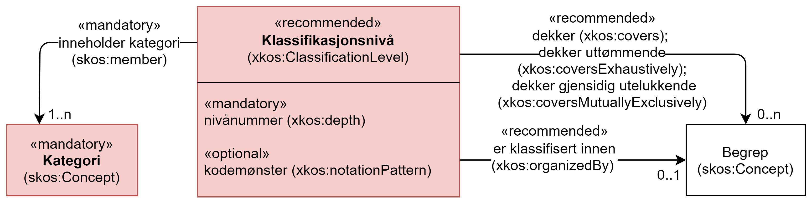

== Klassen Klassifikasjonsnivå (xkos:ClassificationLevel) [[Klassifikasjonsnivå]]

[[img-KlassenKlassifikasjonsnivå]]
.Klassen Klassifikasjonsnivå (xkos:ClasificationLevel) og klassene den refererer til.
[link=images/KlassenKlassifikasjonsnivå.png]

[cols="30s,70d"]
|===
|__English name__ |__Classification level__
|Anvendelse / __Usage note__ | (norsk) Klassen brukes til å representere et nivå i en klassifikasjon.

__(English) This class is used to represent a classification level.__
|URI |xkos:ClassificationLevel
|Subklasse av / __Subclass of__ |skos:Collection
|Kravnivå / __Requirement level__ | Anbefalt / __Recommended__
|Merknad / __Note__ | (norsk) Flate klassifikasjoner betraktes til å inneha ett nivå.

__(English) A flat classification is considered as a classifcation with one level.__
|Eksempel |Nivå 4 «næringsgruppe» i Næringsgruppering 2007.
|===

Eksempel i RDF Turtle:
----
<sn2007-4> a xkos:ClassificationLevel .
----

=== Obligatoriske egenskaper for klassen _Klassifikasjonsnivå_ [[Klassifikasjonsnivå-obligatoriske-egenskaper]]

==== Klassifikasjonsnivå – nivånummer (xkos:depth) [[Klassifikasjonsnivå-nivånummer]]

[cols="30s,70d"]
|===
|__English name__ |__depth__
|URI |xkos:depth
|Range |rdfs:Literal typed as xsd:positiveInteger
|Anvendelse / __Usage note__ | (norsk) Egenskapen brukes til å oppgi nivånummer av det aktuelle klassifikasjonsnivået, dvs. avstanden fra dette nivået til «roten» av klassifikasjonen. 1 for det høyeste nivået.

__(English) This property is used to specify the depth of a level inside a classification (1 for the highest level).__
|Multiplisitet |1..1
|Kravnivå / __Requirement level__ | Obligatorisk / __Mandatory__
|Merknad / __Note__ | (norsk) Det ene nivået i en flat klassifikasjon har verdi 1 som sitt nivånummer.

__(English) The only one level in a flat classification has value 1 as the depth.__
|Eksempel |Nivå 4 «Næringsgruppe» i Næringsgruppering har verdi 4 som nivånummer.
|===

Eksempel i RDF Turtle:
----
<sn2007-4> a xkos:ClassificationLevel ;
   xkos:depth "4"^^xsd:positiveInteger ; .
----

==== Klassifikasjonsnivå – inneholder kategori (skos:member) [[Klassifikasjonsnivå-inneholderKtegori]]

[cols="30s,70d"]
|===
|__English name__ |__member__
|URI |skos:member
|Range |skos:Concept
|Anvendelse / __Usage note__ | (norsk) Egenskapen brukes til å referere til kategorier som klassifikasjonsnivået inneholder.

__(English) This property is used to refer to the classification items that are in the classification level.__
|Multiplisitet |1..n
|Kravnivå / __Requirement level__ | Obligatorisk / __Mandatory__
|Eksempel |Nivå 1 i Næringsgruppering inneholder «A – Jordbruk, skogbruk og fiske», …, og «U – Internasjonale organisasjoner og organer».
|===

Eksempel i RDF Turtle:
----
<sn2007-1> a xkos:ClassificationLevel ;
   skos:member <A> ; . # kun med <A> som eksempel

<A> a skos:Concept ;
   skos:notation "A" ;
   skos:prefLabel "Jordbruk, skogbruk og fiske"@nb ; .

# tilsvarende med de andre nivåene
----

=== Anbefalte egenskaper for klassen _Klassifikasjonsnivå_ [[Klassifikasjonsnivå-anbefalte-egenskaper]]

==== Klassifikasjonsnivå – dekker (xkos:covers) [[Klassifikasjonsnivå-dekker]]

[cols="30s,70d"]
|===
|__English name__ |__covers__
|URI |xkos:covers
|Range |skos:Concept
|Anvendelse / __Usage note__ | (norsk) Egenskapen brukes til å uttrykke at klassifikasjonsnivået dekker et domene/fagområde/el.l. uttømmende, samt å referere til det som dekkes.

__(English) A classification covers a defined field: economic activity, occupations, living organisms, etc. XKOS specifies the `xkos:covers` property to express this relation. __
|Multiplisitet |0..n
|Kravnivå / __Requirement level__ | Anbefalt / __Recommended__
|Merknad / __Note 1__ | (norsk) Ethvert klassifikasjonsnivå i en veldefinert klassifikasjon bør dekke maks. ett domene/fagområde/el.l. 

__(English) A classification level in a well-defined classification shuold cover max. one domain, subject field or such like.__
|Merknad / __Note 2__ | (norsk) Bruk heller egenskapen <<Klassifikasjonsnivå-dekkerUttømmende>> når klassifikasjonsnivået dekker domenet/fagområdet uttømmende, og/eller <<Klassifikasjonsnivå-dekkerGjensidigUtelukkende>> når klassifikasjonsnivået dekker domenet/fagområdet gjensidig utelukkende.  

__(English) Use rather the property <<Klassifikasjonsnivå-dekkerUttømmende>> when the classification level covers the domain / subject field exhaustively, and/or <<Klassifikasjonsnivå-dekkerGjensidigUtelukkende>> when the classification level covers the domain / subject field mutually exclusively.__
|Merknad / __Note 3__ | (norsk) Verdien bør hentes fra veldefinerte kontrollerte vokabularer som f.eks. https://op.europa.eu/s/uBik[EuroVoc &#x29C9;, window="_blank", role="ext-link"], https://id.loc.gov/authorities/subjects.html[Library of Congress Subject Headings (LOCSH) &#x29C9;, window="_blank", role="ext-link"] eller https://psi.norge.no/los/struktur.html[Los &#x29C9;, window="_blank", role="ext-link"].

__(English) The value should be represented by a `skos:Concept`, for example a term from a well-known thesaurus like EuroVoc (https://op.europa.eu/s/uBik[EUROVOC &#x29C9;, window="_blank", role="ext-link"]), the Library of Congress Subject Headings (https://id.loc.gov/authorities/subjects.html[LOCSH &#x29C9;, window="_blank", role="ext-link"]), or https://psi.norge.no/los/struktur.html[Los &#x29C9;, window="_blank", role="ext-link"].__
|Eksempel |«Næringsgruppering 2007» nivå 1 dekker ‘næringsområde’.
|===

Eksempel i RDF Turtle: Se tilsvarende eksempel under <<Klassifikasjon-dekker>>.

==== Klassifikasjonsnivå – dekker gjensidig utelukkende (xkos:coversMutuallyExclusively) [[Klassifikasjonsnivå-dekkerGjensidigUtelukkende]]

[cols="30s,70d"]
|===
|__English name__ |__covers mutually exclusively__
|URI |xkos:coversMutuallyExclusively
|Range |skos:Concept
|Anvendelse / __Usage note__ | (norsk) Egenskapen brukes til å referere til et eller flere begreper som beskriver det domene/fagområde/el.l. som klassifikasjonsnivået dekker gjensidig utelukkende.   

__(English) If the coverage of the given field is complete (i.e. all notions in the field can potentially be classified under the classification level), we say that the coverage is exhaustive. If there is no overlap between the classification items at a given level of the classification, we say that the skos:Concepts representing the items are mutually exclusive.__
|Subegenskap av / __Subproperty of__ |xkos:covers
|Multiplisitet |0..n
|Kravnivå / __Requirement level__ | Anbefalt / __Recommended__
|Merknad / __Note 1__ | (norsk) Et klassifikasjonsnivå i en veldefinert klassifikasjon bør dekke maks. ett domene/fagområde/el.l. og gjensidig utelukkende. Denne egenskapen bør derfor alltid brukes for en veldefinert klassifikasjon.

__(English) A classification level in a well-defined classification should cover max. one domain, subject field or such like, and mutually exclusively. This property should therefore be used for a well-defined classification.__
|Merknad / __Note 2__ | (norsk) Et klassifikasjonsnivå i en veldefinert klassifikasjon dekker vanligvis sitt domene/fagområde/el.l. både uttømmende og gjensidig utelukkende. I slike tilfeller bør både denne egenskapen og <<Klassifikasjonsnivå-dekkerUttømmende>> brukes.

__(English) A classification level in a well-defined classification usually covers the domain, subjecdt field or such like both exhaustively and mutually exclusively. In such cases, both this property and the property <<Klassifikasjonsnivå-dekkerUttømmende>> be used.__
|Merknad / __Note 3__ | (norsk) Verdien bør hentes fra veldefinerte kontrollerte vokabularer som f.eks. https://op.europa.eu/s/uBik[EuroVoc], https://id.loc.gov/authorities/subjects.html[Library of Congress Subject Headings (LOCSH)] eller https://psi.norge.no/los/struktur.html[Los].

__(English) The value should be represented by a `skos:Concept`, for example a term from a well-known thesaurus like EuroVoc (https://op.europa.eu/s/uBik[EUROVOC &#x29C9;, window="_blank", role="ext-link"]), the Library of Congress Subject Headings (https://id.loc.gov/authorities/subjects.html[LOCSH &#x29C9;, window="_blank", role="ext-link"]), or https://psi.norge.no/los/struktur.html[Los &#x29C9;, window="_blank", role="ext-link"].__
|Eksempel |«Næringsgruppering 2007» nivå 1 dekker ‘næringsområde’ med gjensidig utelukkende kategorier.
|===

Eksempel i RDF Turtle: Se tilsvarende eksempel under <<Klassifikasjon-dekkerGjensidigUtelukkende>>.

==== Klassifikasjonsnivå – dekker uttømmende (xkos:coversExhaustively) [[Klassifikasjonsnivå-dekkerUttømmende]]

[cols="30s,70d"]
|===
|__English name__ |__covers exhaustively__
|URI |xkos:coversExhaustively
|Range |skos:Concept
|Anvendelse / __Usage note__ | (norsk) På ethvert nivå i en veldefinert klassifikasjon er kategoriene gjensidig utelukkende. Denne egenskapen brukes til å uttrykke dette, samt å referere til begrep som kategoriene dekker. 

__(English) If the coverage of the given field is complete (i.e. all notions in the field can potentially be classified under the classification), we say that the coverage is exhaustive.__
|Subegenskap av / __Subproperty of__ |xkos:covers
|Multiplisitet|0..n
|Kravnivå / __Requirement level__ | Anbefalt / __Recommended__
|Merknad / __Note 1__ | (norsk) Et klassifikasjonsnivå i en veldefinert klassifikasjon bør dekke maks. ett domene/fagområde/el.l. og uttømmende. Denne egenskapen bør derfor alltid brukes for en veldefinert klassifikasjon.

__(English) A classification level in a well-defined classification should cover max. one domain, subject field or such like, and mutually exclusively. This property should therefore be used for a well-defined classification.__
|Merknad / __Note 2__ | (norsk) Verdien bør hentes fra veldefinerte kontrollerte vokabularer som f.eks. https://op.europa.eu/s/uBik[EuroVoc &#x29C9;, window="_blank", role="ext-link"], https://id.loc.gov/authorities/subjects.html[Library of Congress Subject Headings (LOCSH) &#x29C9;, window="_blank", role="ext-link"] eller https://psi.norge.no/los/struktur.html[Los &#x29C9;, window="_blank", role="ext-link"].

__(English) The value should be represented by a `skos:Concept`, for example a term from a well-known thesaurus like EuroVoc (https://op.europa.eu/s/uBik[EUROVOC &#x29C9;, window="_blank", role="ext-link"]), the Library of Congress Subject Headings (https://id.loc.gov/authorities/subjects.html[LOCSH &#x29C9;, window="_blank", role="ext-link"]), or https://psi.norge.no/los/struktur.html[Los &#x29C9;, window="_blank", role="ext-link"].__
|Eksempel |«Næringsgruppering2007» nivå 1 dekker ‘næringsområde’ uttømmende.
|===

Eksempel i RDF Turtle: Se tilsvarende eksempel under <<Klassifikasjon-dekkerUttømmende>>.

==== Klassifikasjonsnivå – er klassifisert innen (xkos:organizedBy) [[Klassifikasjonsnivå-erKlassifisertInnen]]

[cols="30s,70d"]
|===
|__English name__ |__organized by__
|URI |xkos:organizedBy
|Range |skos:Concept
|Anvendelse / __Usage note__ | (norsk) Egenskapen brukes til å referere til begrep som kategoriene i klassifikasjonsnivået er klassifisert innen.

__(English) This property is used to specify the name (or nature, or type) of the items that constitute the level.__
|Multiplisitet |0..1
|Kravnivå / __Requirement level__ | Anbefalt / __Recommended__
|Eksempel |«Næringsgruppering 2007» er klassifisert innen: nivå 1 = Næringshovedområde, nivå 2 = Næring, nivå 3 = Næringshovedgruppe, nivå 4 = Næringsgruppe og nivå 5 = Næringsundergruppe.
|===

Eksempel i RDF Turtle:
----
# her kun med eksempel i nivå 4:
<sn2007-4> a xkos:ClassificationLevel ;
   xkos:organizedBy [ a skos:Concept ; skos:prefLabel "Næringsgruppe"@nb ; ] ; .
----

=== Valgfrie egenskaper for klassen _Klassifikasjonsnivå_ [[Klassifikasjonsnivå-valgfrie-egenskaper]]

==== Klassifikasjonsnivå – kodemønster (xkos:notationPattern) [[Klassifikasjonsnivå-kodemønster]]

[cols="30s,70d"]
|===
|__English name__ |__notation pattern__
|URI |xkos:notationPattern
|Range |rdfs:Literal
|Anvendelse / __Usage note__ | (norsk) Egenskapen brukes til å oppgi mønsteret for kodene på et gitt klassifikasjonsnivå. Verdien bør inneholde et https://en.wikipedia.org/wiki/Regular_expression[regulært uttrykk &#x29C9;, window="_blank", role="ext-link"].

__(English) Classification items of a given levels usually have a code (expressed by the `skos:notation` property) that conforms to a specific structure. In order to capture this information, XKOS defines the `xkos:notationPattern` property. This property is attached to a classification level and should contain a https://en.wikipedia.org/wiki/Regular_expression[regular expression &#x29C9;, window="_blank", role="ext-link"] reflecting the code structure of the items of this level.__
|Multiplisitet |0..n
|Kravnivå / __Requirement level__ | Valgfri / __Optional__
|Eksempel / __Example__ | (norsk) Kodene på nivå 1 i «Næringsgruppering 2007» er én stor bokstav (fra A til U).

__(English) For example, the NACE sections are identified by a capital letter between A and U.__
|===

Eksempel i RDF Turtle:
----
<sn2007-1> a xkos:ClassificationLevel ;
   xkos:notationPattern "[A-U]" ; .
----
