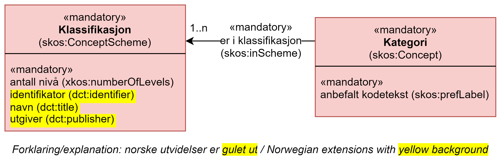

== Forenklet modell for XKOS-AP-NO [[ForenkletModell]]

[[img-ForenkletModellObligatoriske]]
.Forenklet modell for XKOS-AP-NO, med kun obligatoriske klasser og deres obligatoriske egenskaper.
[link=images/ForenkletModell-XKOS-AP-NO-Obligatoriske.png]

[[img-ForenkletModellObligatoriskeOgAnbefalte]]
.Forenklet modell for XKOS-AP-NO, med obligatoriske og anbefalte klasser og deres obligatoriske og anbefalte egenskaper.
[link=images/ForenkletModell-XKOS-AP-NO-ObligatoriskeOgAnbefalte.png]
image::images/ForenkletModell-XKOS-AP-NO-ObligatoriskeOgAnbefalte.png[]

[[img-ForenkletModell-XKOS-AP-NO]]
.Forenklet modell for XKOS-AP-NO, med alle klasser.
[link=images/ForenkletModell-XKOS-AP-NO.png]
image::images/ForenkletModell-XKOS-AP-NO.png[]

Figurene ovenfor viser forenklet modell for XKOS-AP-NO. Diagrammene i figurene er ikke ment som en formell representasjon av XKOS-AP-NO, men kun for å gi en visuell oversikt over klassene og relasjoner mellom klassene. Inntil eventuell overensstemmelse blir rettet opp, har de tekstlige beskrivelsene av klasser og egenskaper forrang. Tilsvarende forrang gjelder også forholdet mellom diagrammene og de tekstlige beskrivelsene i kapitlene der klassene blir nærmere beskrevet.
