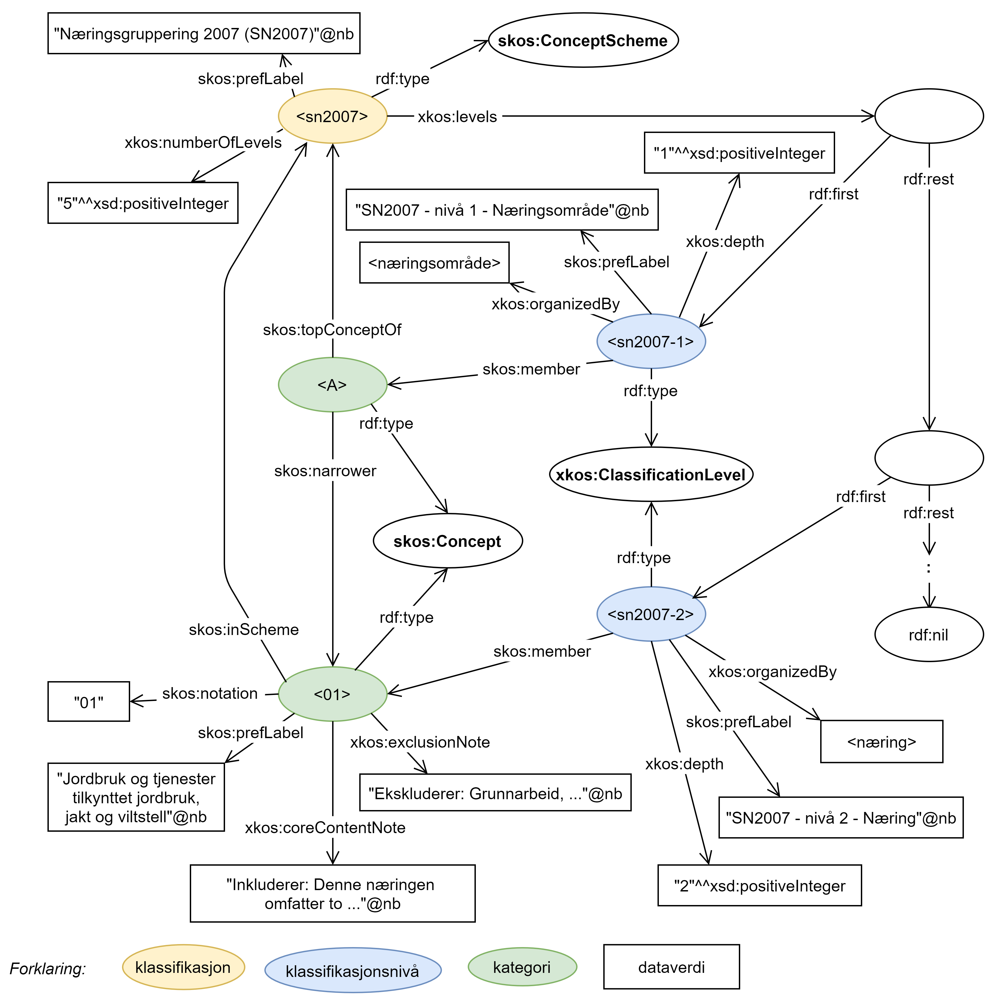
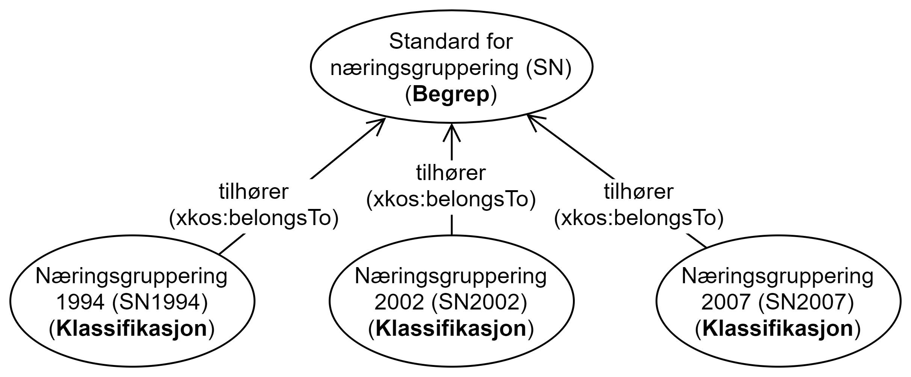

== Innledning - Klassifikasjon, Klassifikasjonsnivå og Kategori [[Innledning]]

_Kapitlet er ikke-normativt_.

En *klassifikasjon* er som oftest hierarkisk oppbygd og består av **klassifikasjonsnivå**er, selv om det også finnes «flate» klassifikasjoner som har kun ett klassifikasjonsnivå. På hvert nivå (også det ene nivået i en «flat» klassifikasjon) blir «tingene» klassifisert inn i **kategori**er. De viktigste klassene for klassifikasjonsbeskrivelser er derfor Klassifikasjon, Klassifikasjonsnivå og Kategori.

Som et eksempel som vi også kommer til å bruke i resten av dette dokumentet: https://www.ssb.no/klass/klassifikasjoner/6[«Næringsgruppering 2007 (SN2007)»] forvaltet og utgitt av SSB, er en klassifikasjon. Den har til sammen fem klassifikasjonsnivåer. Nivå 1 klassifiserer «næringsområde» inn i kategoriene «A – Jordbruk, skogbruk og fiske», …, «U – Internasjonale organisasjoner og organer». Nivå 1 er uttømmende og kategoriene på nivå 1 er også gjensidig utelukkende. Tilsvarende med nivå 2 til 5.

[[img-Eksempel1]]
.Klassifikasjon, Klassifikasjonsnivå og Kategori, uttrykt med XKOS-AP-NO og illustrert med et utsnitt av «Næringsgruppering 2007».
[link=images/Eksempel1Næringsgruppering.png]

Figuren ovenfor illustrerer hvordan deler av «Næringsgruppering 2007 (SN2007)» beskrives i henhold til XKOS-AP-NO. En RDF Turtle representasjon av deler av «Næringsgruppering 2007 (SN 2007)» tilsvarende figuren ovenfor, finnes på https://github.com/Informasjonsforvaltning/xkos-ap-no/blob/develop/examples/EksempelSn2007.ttl[Github].

Hver versjon av en klassifikasjon er i seg selv en klassifikasjon. Versjoner av en klassifikasjon kan grupperes under f.eks. et begrep, ved hjelp av egenskapen «tilhører (`xkos:belongsTo`)». Figuren nedenfor illustrerer at versjonene «Næringsgruppering 1994 (SN1994)», «Næringsgruppering 2002 (SN2007)» og «Næringsgruppering 2007 (SN2007)» tilhører «Standard for næringsgruppering (SN)».

[[img-EKsempel2]]
.Eksempel – Standard for næringsgruppering, med de ulike versjonene.
[link=images/Eksempel2NæringsgrupperingHovedversjoner.png]

