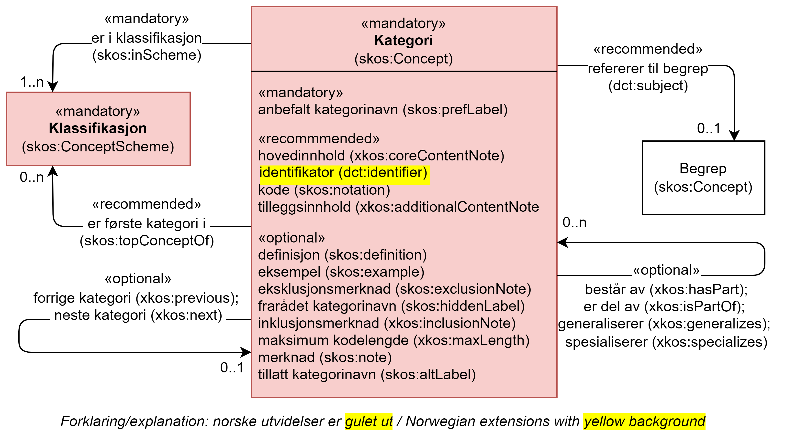

== Klassen Kategori (skos:Concept) [[Kategori]]

[[img-KlassenKategori]]
.Klassen Kategori (skos:Concept) og klassene den refererer til.
[link=images/KlassenKategori.png]

[cols="30s,70d"]
|===
|English name |category, classification item
|Beskrivelse |Brukes til å representere en kategori i en klassifikasjon/klassifikasjonsnivå.
|Usage note |To represent a category in a classification or classification level.
|URI |skos:Concept
|Kravsnivå |Obligatorisk/Mandatory
|Merknad|
|Eksempel |Kategorien med kode «A» på nivå 1 i klassifikasjonen «Næringsgruppering 2007».
|===

Eksempel i RDF Turtle:
----
<A> a skos:Concept ;
   skos:notation "A" ;
   skos:prefLabel "Jordbruk, skogbruk og fiske"@nb ; .

----

=== Obligatoriske egenskaper for klassen _Kategori_ [[Kategori-obligatoriske-egenskaper]]

==== Kategori – anbefalt kategorinavn (skos:prefLabel) [[Kategori-anbefaltKategorinavn]]

[cols="30s,70d"]
|===
|English name |official label
|URI |skos:prefLabel
|Range |rdfs:Literal
|Beskrivelse |Brukes til å oppgi det anbefalte kategorinavnet for kategorien. Gjentas når navnet finnes i flere språk.
|Usage note |To specify the official label for the classification item, repeated when the label is in different languages.
|Multiplisitet |1..n
|Kravsnivå |Obligatorisk/Mandatory
|Merknad|
|Eksempel |«Jordbruk, skogbruk og fiske» er anbefalt kategorinavn på norsk for kategorien med koden «A», på nivå 1 i «Næringsgruppering 2007».
|===

Eksempel i RDF Turtle:
----
<A> a skos:Concept ;
   skos:notation "A" ;
   skos:prefLabel "Jordbruk, skogbruk og fiske"@nb ; .
----

==== Kategori – er i klassifikasjon (skos:inScheme) [[Kategori-erIKlassifikasjon]]

[cols="30s,70d"]
|===
|English name |in classification
|URI |skos:inScheme
|Range |skos:ConceptScheme
|Beskrivelse |Brukes til å knytte kategorien til en eller flere klassifikasjoner.
|Usage note |To connect the category to a classification of classification level.
|Multiplisitet |1..n
|Kravsnivå |Obligatorisk/Mandatory
|Merknad|
|Eksempel |Kategorien med kode «A» er i klassifikasjonen «Næringsgruppering 2007».
|===

Eksempel i RDF Turtle:
----
<A> a skos:Concept ;
   skos:notation "A" ;
   skos:prefLabel "Jordbruk, skogbruk og fiske"@nb ;
   skos:inScheme <sn2007> ; .

<sn2007> a skos:ConceptScheme ; .
----

=== Anbefalte egenskaper for klassen _Kategori_ [[Kategori-anbefalte-egenskaper]]

==== Kategori – er første kategori i (skos:topConceptOf) [[Kategori-erFørsteKategoriI]]

[cols="30s,70d"]
|===
|English name |first category
|URI |skos:topConceptOf
|Range |skos:ConceptScheme
|Beskrivelse |Brukes til å referere til en klassifikasjon hvor denne kategorien er den første.
|Usage note |To refer to the classification in which the category is the first one.
|Multiplisitet|0..n
|Kravsnivå |Anbefalt/Recommended
|Merknad |Ordet «første» bør forståes innenfor konteksten av den aktuelle klassifikasjonen. I en veldefinert klassifikasjon skal derfor kun én kategori ha denne egenskapen.
|Eksempel |«A – Jordbruk, skogbruk og fiske» er den første kategorien i «Næringsgruppering 2007 (SN2007)»
|===

Eksempel i RDF Turtle:
----
<A> a skos:Concept ;
   skos:notation "A" ;
   skos:prefLabel "Jordbruk, skogbruk og fiske"@nb ;
   skos:topConceptOf <sn2007> .

<sn2007> a skos:ConceptScheme ; .
----

==== Kategori – hovedinnhold (xkos:coreContentNote) [[Kategori-hovedinnhold]]

[cols="30s,70d"]
|===
|English name |core content note
|URI |xkos:coreContentNote
|Range |rdfs:Literal
|Beskrivelse |Brukes til å oppgi hva som er hovedinnholdet i kategorien. Gjentas når teksten er i flere ulike språk.
|Usage note |To specify the core content of the classification item, repeated when the note is in different languages.
|Subegenskap av / Subproperty of |xkos:inclusionNote
|Multiplisitet |0..n
|Kravsnivå |Anbefalt/Recommended
|Merknad|
|Eksempel |Kategori med koden «01» i «Næringsgruppering 2007 (SN 2007)» har følgende note om hovedinnhold: "Inkluderer: Denne næringen omfatter to basisaktiviteter: produksjon av vegetabilske og animalske produkter, jordbruk, dyrking av genetisk modifiserte vekster og oppdrett av genetisk modifiserte dyr. Både dyrking av vekster på friland og i veksthus inngår."
|Example |`xkos:coreContentNote` is generally labelled "This category includes", "This item includes", "This division includes", "Includes" or similar.
|===

Eksempel I RDF Turtle:
----
<01> a skos:Concept ;
  skos:prefLabel "Jordbruk og tjenester tilknyttet jordbruk, jakt og viltstell"@nb ; # kategorinavn
  skos:notation "01" ; # kode
  xkos:coreContentNote "Inkluderer: Denne næringen omfatter to basisaktiviteter: produksjon av vegetabilske og animalske produkter, jordbruk, dyrking av genetisk modifiserte vekster og oppdrett av genetisk modifiserte dyr. Både dyrking av vekster på friland og i veksthus inngår."@nb ; # hovedinnhold
  xkos:additionalContentNote "Inkluderer også: Omfatter også tjenester tilknyttet jordbruk, jakt og fangst."@nb ; # tilleggsinnhold
  xkos:exclusionNote "Ekskluderer: Grunnarbeid, f.eks. anlegg av jordterrasser, drenering o.l. grupperes under næringshovedområde: F Bygge- og anleggsvirksomhet. Kjøpere og andelslag engasjert i markedsføring av jordbruksprodukter grupperes under næringshovedområde: G Varehandel, reparasjon av motorvogner. Stell og vedlikehold av landskap grupperes under: 81.30 Beplantning av hager og parkanlegg."@nb ; # eksklusjon
  skos:inScheme <sn2007> ; .
----

==== Kategori – identifikator (dct:identifier) [[Kategori-identifikator]]

[cols="30s,70d"]
|===
|English name |identifier
|URI |dct:identifier
|Range |rdfs:Literal
|Beskrivelse |Brukes til å oppgi en unik og persistent identifikator til kategorien.
|Usage note |To specify a unique and persistent identifier to the category.
|Multiplisitet|0..1
|Kravsnivå |Anbefalt/Recommended
|Merknad 1 |Identifikator er som regel systemgenerert av verktøystøtte, slik at du som vanlig bruker ikke trenger å fylle ut verdien til denne egenskapen manuelt.

For deg som skal utvikle/tilpasse verktøystøtte, se https://data.norge.no/guide/veileder-beskrivelse-av-datasett/#om-identifikator[Om identifikator (dct:identifer) i Veileder for beskrivelse av datasett osv.]
|Merknad 2 |Norsk utvidelse: ikke eksplisitt tatt med i XKOS.
|Eksempel |
|===

==== Kategori – kode (skos:notation) [[Kategori-kode]]

[cols="30s,70d"]
|===
|English name |code
|URI |skos:notation
|Range |rdfs:Literal
|Beskrivelse |Brukes til å oppgi koden for kategorien.
|Usage note |To specify the code for the classification item.
|Multiplisitet |0..n
|Kravsnivå |Anbefalt/Recommended
|Merknad |Samme kategori kan inngå i ulike varianter/klassifikasjoner og da også med ulike koder.
|Eksempel |«A» er koden for kategorien med kategorinavn «Jordbruk, skogbruk og fiske», på nivå 1 i «Næringsgruppering 2007 (SN2007)».
|===

Eksempel i RDF Turtle:
----
<A> a skos:Concept ;
   skos:notation "A" ;
   skos:prefLabel "Jordbruk, skosbruk og fiske"@nb ,
      "Agriculture, forestry and fishing"@en .

<031> a skos:Concept ;
   skos:notation "03.1" ; # koden i denne klassifikasjonen
   skos:prefLabel "Fiske og fangst"@nb ,
   skos:notation "01.20.00"^^ssb:miljøregnskap2012 ; . # koden i en annen klassifikasjon

ssb:miljøregnskap2012 a skos:ConceptScheme ; .
----

==== Kategori – refererer til begrep (dct:subject) [[Kategori-referererTilBegrep]]

[cols="30s,70d"]
|===
|English name |concept
|URI |dct:subject
|Range |skos:Concept
|Beskrivelse |Brukes til å referere til sentralt begrep som er viktig for å forstå og tolke kategorien.
|Usage note |To refer to the concept which is important in order to understand the category.
|Multiplisitet |0..1
|Kravsnivå |Anbefalt/Recommended
|Merknad |
|Eksempel |Kategorien med koden «A» i «Næringsgruppering 2007» refererer til begrepet ‘primærnæring’.
|===

Eksempel i RDF Turtle:
----
<A> a skos:Concept ;
   skos:notation "A" ;
   skos:prefLabel "Jordbruk, skosbruk og fiske"@nb ;
   dct:subject <primærnæring> .

<primærnæring> a skos:Concept ; .
----

==== Kategori – tilleggsinnhold (xkos:additionalContentNote) [[Kategori-tilleggsinnhold]]

[cols="30s,70d"]
|===
|English name |additional content note
|URI |xkos:additionalContentNote
|Range |rdfs:Literal
|Beskrivelse |Brukes til å oppgi tilleggsinnholdet i kategorien. Gjentas når teksten er i flere ulike språk.
|Usage note |To specific additional content to the classification item, repeated when the note is in different languages.
|Subegenskap av / Subproperty of |xkos:inclusionNote
|Multiplisitet |0..n
|Kravsnivå |Anbefalt/Recommended
|Merknad |
|Eksempel |Kategori med koden «01» i «Næringsgruppering 2007 (SN 2007)» har følgende note om tilleggsinnhold: «Inkluderer også: Omfatter også tjenester tilknyttet jordbruk, jakt og fangst.»
|Example |`xkos:additionalContentNote` is generally labelled "This category includes also", "This item includes also", "This division includes also", "Includes also", or similar.
|===

Eksempel i RDF Turtle: Se under <<Kategori-hovedinnhold>>.

=== Valgfrie egenskaper for klassen _Kategori_ [[Kategori-valgfrie-egenskaper]]

==== Kategori – består av (xkos:hasPart) [[Kategori-bestårAv]]

[cols="30s,70d"]
|===
|English name | has part
|URI |xkos:hasPart
|Range |skos:Concept
|Beskrivelse |Brukes til å referere til kategorier som den aktuelle kategorien består av, i en partitiv relasjon mellom kategoriene.
|Usage note |To refer to categories which the category in question consists of, in a partitive relationship between the categories.
|Multiplisitet |0..n
|Kravsnivå |Valgfri/Optional
|Merknad |
|Eksempel | 'ukedag' består av 'mandag', 'tirsdag', 'onsdag', 'torsdag', 'fredag', 'lørdag' og 'søndag'.
|===

Eksempel i RDF Turtle:
----
<ukedag> a skos:Concept ;
   xkos:hasPart <mandag>, <tirsdag>, <onsdag>, <torsdag>, <fredag>, <lørdag>, <søndag> ; .
----

==== Kategori – definisjon (skos:definition) [[Kategori-definisjon]]

[cols="30s,70d"]
|===
|English name |definition
|URI |skos:definition
|Range |rdfs:Literal
|Beskrivelse |Brukes til å oppgi definisjonen av begrepet som kategorien representerer. Gjentas når definisjonen finnes i flere ulike språk.
|Usage note |To specify the definition of the concept that the category represents, repeated when the definition is in different languages.
|Multiplisitet |0..n
|Kravsnivå |Valgfri
|Merknad |Bruk heller egenskapen <<Kategori-referererTilBegrep>> til å referere til en begrepsbeskrivelse som er tilgjengeliggjort f.eks. i begrepsdelen av https://data.norge.no/concepts/[Felles datakatalog] og som inneholder definisjonen av begrepet, istedenfor å duplisere/«gjemme» definisjonen i en klassifikasjon.
|Eksempel |
|===

==== Kategori – eksempel (skos:example) [[Kategori-eksempel]]

[cols="30s,70d"]
|===
|English name |example
|URI |skos:example
|Range |rdfs:Literal
|Beskrivelse |Brukes til å oppgi i fritekst eksempler på hva er kategorisert under kategorien. Gjentas når teksten er i flere ulike språk.
|Usage note |To specify examples of the content of the category, repeated when the text is in different languages.
|Multiplisitet |0..n
|Kravsnivå |Valgfri/Optional
|Merknad |
|Eksempel |For kategori med koden «A» i «Næringsgruppering 2007 (SN 2007)»: Jordbruk og tjenester tilknyttet jordbruk, jakt og viltstell, skogbruk og tjenester tilknyttet skogbruk, fiske, fangst og akvakultur.
|===

Eksempel i RDF Turtle:
----
<A> a skos:Concept ;
   skos:notation "A" ;
   skos:prefLabel "Jordbruk, skogbruk og fiske"@nb ;
   skos:example "Jordbruk og tjenester tilknyttet jordbruk, jakt og viltstell, skogbruk og tjenester tilknyttet skogbruk, fiske, fangst og akvakultur"@nb ; .
----

==== Kategori – eksklusjonsmerknad (skos:exclusionNote) [[Kategori-eksklusjonsmerknad]]

[cols="30s,70d"]
|===
|English name |exclusion note
|URI |xkos:exclusionNote
|Range |rdfs:Literal
|Beskrivelse |Brukes til å oppgi hva som ikke er inkludert i kategorien. Gjentas når merknaden finnes i flere ulike språk.
|Usage note |To specify what is not included in the category, repeated when the note is in different languages.
|Subegenskap av / Subproperty of |skos:scopeNote
|Multiplisitet |0..n
|Kravsnivå |Valgfri/Optional
|Merknad |
|Eksempel |Kategori med koden «01» i «Næringsgruppering 2007 (SN 2007)» har følgende eksklusjonsnote: «Ekskluderer: Grunnarbeid, f.eks. anlegg av jordterrasser, drenering o.l. grupperes under næringshovedområde: F Bygge- og anleggsvirksomhet. Kjøpere og andelslag engasjert i markedsføring av jordbruksprodukter grupperes under næringshovedområde: G Varehandel, reparasjon av motorvogner. Stell og vedlikehold av landskap grupperes under: 81.30 Beplantning av hager og parkanlegg.»
|===

Eksempel I RDF Turtle: Se under <<Kategori-hovedinnhold>>.

==== Kategori – er del av (xkos:isPartOf) [[Kategori-erDelAv]]

[cols="30s,70d"]
|===
|English name | is part of
|URI |xkos:isPartOf
|Range |skos:Concept
|Beskrivelse |Brukes til å referere til kategorier som den aktuelle kategorien er del av, i en partitiv relasjon mellom kategoriene.
|Usage note |To refer to categories which the category in question is part of, in a partitive relationship between the categories.
|Multiplisitet |0..n
|Kravsnivå |Valgfri/Optional
|Merknad |
|Eksempel | 'mandag' er del av 'ukedag'.
|===

Eksempel i RDF Turtle:
----
<mandag> a skos:Concept ;
   xkos:isPartOf <ukedag> ; .
----

==== Kategori – forrige kategori (xkos:previous) [[Kategori-forrigeKategori]]

[cols="30s,70d"]
|===
|English name |previous
|URI |xkos:previous
|Range |skos:Concept
|Beskrivelse |Brukes til å referere til kategorien som er foran den aktuelle kategorien, i en sekvensiell relasjon mellom kategoriene.
|Usage note |To refer to the category that is before the category in question, in a sequential relation between the categories.
|Multiplisitet |0..1
|Kravsnivå |Valgfri/Optional
|Merknad |Ordene «forrige» og «foran» bør forståes innenfor konteksten av det aktuelle klassifikasjonsnivået i den aktuelle klassifikasjonen.
|Eksempel |Den forrige kategori til «B» er «A» i Nivå 1 av «Næringsgruppering 2007 (SN 2007)»
|===

Eksempel i RDF Turtle:
----
<B> a skos:Concept ;
   xkos:previus <A> ; .
----

==== Kategori – frarådet kategorinavn (skos:hiddenLabel) [[Kategori-frarådetKategorinavn]]

[cols="30s,70d"]
|===
|English name |hidden label
|URI |skos:hiddenLabel
|Range |rdfs:Literal
|Beskrivelse |Brukes til å oppgi kategorinavn som anses som uegnet for kategorien. Gjentas når navnet finnes i flere ulike språk.
|Usage note |To specify the label that is considered as not suitable for the classification item, repeated when the label is in different languages.
|Multiplisitet |0..n
|Kravsnivå |Valgfri/Optional
|Merknad |
|Eksempel |
|===

==== Kategori – generaliserer (xkos:generalizes) [[Kategori-generaliserer]]

[cols="30s,70d"]
|===
|English name | generalizes
|URI |xkos:generalizes
|Range |skos:Concept
|Beskrivelse |Brukes til å referere til kategorier som den aktuelle kategorien generaliserer, i en generisk relasjon mellom kategoriene.
|Usage note |To refer to categories which the category in question generalizes, in a generic relationship between the categories.
|Multiplisitet |0..n
|Kravsnivå |Valgfri/Optional
|Merknad |
|Eksempel | Kategorien med kode «A» på nivå 1 i klassifikasjonen «Næringsgruppering 2007» generaliserer kategoriene med kode «01», «02» og «03» på nivå 2.
|===

Eksempel i RDF Turtle:
----
<A> a skos:Concept ;
   xkos:generalizes <01>, <02>, <03> ; .
----

==== Kategori – inklusjonsmerknad (xkos:inclusionNote) [[Kategori-inklusjonsmerknad]]

[cols="30s,70d"]
|===
|English name |inclusion note
|URI |xkos:inclusionNote
|Range |rdfs:Literal
|Beskrivelse |Brukes til å oppgi merknad om hva som er inkludert i kodeelementet. Gjentas når merknaden finnes i flere ulike språk.
|Usage note |To specify what is included in the category, repeated when the note is in different languages.
|Subegenskap av / Subproperty of |skos:scopeNote
|Multiplisitet |0..n
|Kravsnivå |Valgfri/Optional
|Merknad |Bruk heller den semantisk sett mer presise egenskapen <<Kategori-hovedinnhold>>, ev. kombinert med egenskapen <<Kategori-tilleggsinnhold>>.
|Eksempel |
|===

==== Kategori – maksimum kodelengde (xkos:maxLength) [[Kategori-maksimumKodelengde]]

[cols="30s,70d"]
|===
|English name |max length
|URI |xkos:maxLength
|Range |rdfs:Literal typed as xsd:positveInteger
|Beskrivelse |Brukes til å oppgi maksimum kodelengde.
|Usage note |To specify the maximum number of characters for a label that is constrained in length.
|Multiplisitet |0..1
|Kravsnivå |Valgfri/Optional
|Merknad |For deg som skal utvikle/tilpasse verktøystøtte, se Remarks under.
|Remarks a|According to https://rdf-vocabulary.ddialliance.org/xkos.html#add-labels[XKOS]:

In all cases the `skos:prefLabel` property is used to express the full (official) label. For the additional fixed-length labels, `skosxl:Label` instances are created with the `xkos:maxLength` property indicating the maximum length of these additional labels. Two cases must be distinguished:

* If the additional label is different from the full label, the `skosxl:Label` is attached by a `skosxl:altLabel` property.
* If the additional label is equal to the full label, the `skosxl:Label` must be attached by a `skosxl:prefLabel` property in order to comply with the SKOS integrity rules about labels.
|Eksempel |
|===

==== Kategori – merknad (skos:note) [[Kategori-merknad]]

[cols="30s,70d"]
|===
|English name |note
|URI |skos:note
|Range |rdfs:Literal
|Beskrivelse |Brukes til å oppgi merknad om kategorien. Gjentas når merknaden finnes i flere ulike språk/målformer.
|Usage note |To specify any note about the classification item, repeated when the note is in different languages.
|Multiplisitet |0..n
|Kravsnivå |Valgfri/Optional
|Merknad |Brukes kun til merknader som ikke kan tas med i en av de andre semantisk sett mer presise egenskapene som <<Kategori-eksklusjonsmerknad>>, <<Kategori-hovedinnhold>> og <<Kategori-tilleggsinnhold>>.
|Eksempel |
|===

==== Kategori – neste kategori (xkos:next) [[Kategori-nesteKategori]]

[cols="30s,70d"]
|===
|English name |next
|URI |xkos:next
|Range |skos:Concept
|Beskrivelse |Brukes til å referere til kategorien som er bak den aktuelle kategorien, i en sekvensiell relasjon mellom kategoriene.
|Usage note |To refer to the category that is after the category in question, in a sequential relation between the categories.
|Multiplisitet |0..1
|Kravsnivå |Valgfri/Optional
|Merknad |Ordene «neste» og «bak» bør forståes innenfor konteksten av det aktuelle klassifikasjonsnivået i den aktuelle klassifikasjonen.
|Eksempel |Den neste kategori for «A» er «B» i Nivå 1 av «Næringsgruppering 2007 (SN 2007)»
|===

==== Kategori – spesialiserer (xkos:specializes) [[Kategori-spesialiserer]]

[cols="30s,70d"]
|===
|English name | specializes
|URI |xkos:specializes
|Range |skos:Concept
|Beskrivelse |Brukes til å referere til kategorier som den aktuelle kategorien spesialiserer, i en generisk relasjon mellom kategoriene.
|Usage note |To refer to categories which the category in question specializes, in a generic relationship between the categories.
|Multiplisitet |0..n
|Kravsnivå |Valgfri/Optional
|Merknad |
|Eksempel | Kategorien med kode «01» på nivå 2 i klassifikasjonen «Næringsgruppering 2007» spesialiserer kategorien med kode «A» på nivå 1.
|===

Eksempel i RDF Turtle:
----
<01> a skos:Concept ;
   xkos:specializes <A> ; .
----

==== Kategori – tillatt kategorinavn (skos:altLabel) [[Kategori-tillattKategorinavn]]

[cols="30s,70d"]
|===
|English name |alternative label
|URI |skos:altLabel
|Range |rdfs:Literal
|Beskrivelse |Brukes til å oppgi alternativt kategorinavn (som kan brukes ved siden av det anbefalte kategorinavnet). Gjentas når navnet finnes i flere ulike språk.
|Usage note |To specify alternative label of the category, repeated when the label is in different languages.
|Multiplisitet |0..n
|Kravsnivå |Valgfri/Optional
|Merknad |
|Eksempel |Kategorien med kode «D» og anbefalt tekst «Elektrisitets-, gass-, damp- og varmtvannsforsyning» i «Næringsgruppering 2007» har tillatt kategorinavn «Kraftforsyning».
|===

Eksempel i RDF Turtle:
----
<sn2007-D> a skos:Concept ;
   skos:notation "D" ;
   skos:prefLabel "Elektrisitets-, gass-, damp- og varmtvannsforsyning"@nb ;
   skos:altLabel "Kraftforsyning"@nb ; .

----
