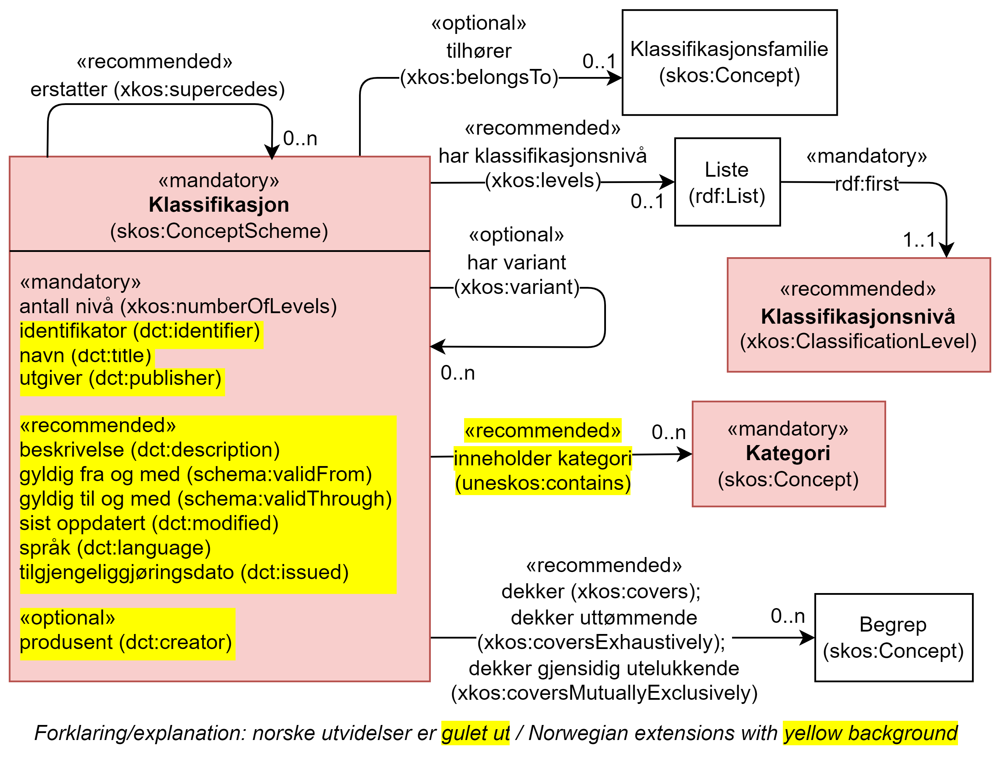

== Klassen Klassifikasjon (skos:ConceptScheme) [[Klassifikasjon]]

[[img-KlassenKlassifikasjon]]
.Klassen Klassifikasjon (skos:ConceptScheme) og klassene den refererer til.
[link=images/KlassenKlassifikasjon.png]

[cols="30s,70d"]
|===
|English name |Classification
|Anvendelse |Brukes til å representere en klassifikasjon, en variant eller en versjon av en klassifikasjon.
|Usage note |To represent a classification, a variant of a version of a classification.
|URI |skos:ConceptScheme
|Kravnivå |Obligatorisk/Mandatory
|Merknad |I konteksten av dette dokumentet er en gitt variant/versjon av en klassifikasjon også en klassifikasjon.
|Eksempel |Næringsgruppering 2007 (SN 2007)
|===

Eksempel i RDF Turtle:
----
<sn2007> a skos:ConceptScheme ;
   skos:prefLabel "Næringsgruppering 2007"@nb ;
   xkos:belongsTo <sn> .

<sn> a skos:Concept ;
   skos:prefLabel "Standard for næringsgruppering"@nb ; .
----

=== Obligatoriske egenskaper for klassen _Klassifikasjon_ [[Klassifikasjon-obligatoriske-egenskaper]]

==== Klassifikasjon – antall nivåer (xkos:numberOfLevels) [[Klassifikasjon-antallNivåer]]

[cols="30s,70d"]
|===
|English name |number of levels
|URI |xkos:numberOfLevels
|Range |rdfs:Literal typed as xsd:positiveInteger
|Anvendelse |Brukes til å oppgi antall nivåer i klassifikasjonen; 1 for en flat klassifikasjon.
|Usage note |To document number of levels the classification includes; 1 for a flat classification.
|Multiplisitet |1..1
|Kravnivå |Obligatorisk/Mandatory
|Merknad |
|Eksempel |«Næringsgruppering 2007» har totalt fem nivåer.
|===

Eksempel i RDF Turtle:
----
<sn2017> a skos:ConceptScheme ;
   xkos:numberOfLevels "5"^^xsd:positiveInteger .

----

==== Klassifikasjon – identifikator (dct:identifier) [[Klassifikasjon-identifikator]]

[cols="30s,70d"]
|===
|English name |identifier
|URI |dct:identifier
|Range |rdfs:Literal typed as xsd:anyURI
|Anvendelse |Brukes til å oppgi identifikatoren til klassifikasjonen
|Usage note |To refer to the identifier of the classification.
|Multiplisitet |1..1
|Kravnivå |Obligatorisk/Mandatory
|Merknad 1 |Identifikator er som regel systemgenerert av verktøystøtte, slik at du som vanlig bruker ikke trenger å fylle ut verdien til denne egenskapen manuelt.

For deg som skal utvikle/tilpasse verktøystøtte, se https://data.norge.no/guide/veileder-beskrivelse-av-datasett/#om-identifikator[Om identifikator (dct:identifer) i Veileder for beskrivelse av datasett osv.]
|Merknad 2 |Norsk utvidelse: ikke eksplisitt tatt med i XKOS.
|Eksempel |https://www.ssb.no/klass/klassifikasjoner/6[https://www.ssb.no/klass/klassifikasjoner/6] for «Næringsgruppering 2007 (SN 2007)»
|===

Eksempel i RDF Turtle:
----
<sn2017> a skos:ConceptScheme ;
   dct:identifier "https://www.ssb.no/klass/klassifikasjoner/6"^^xsd:anyURI .
----

==== Klassifikasjon – navn (dct:title) [[Klassifikasjon-navn]]

[cols="30s,70d"]
|===
|English name |name
|URI |dct:title
|Range |rdfs:Literal
|Anvendelse |Brukes til å oppgi navnet til klassifikasjonen. Gjentas når navnet finnes i flere språk.
|Usage note |To specify the name of the classification, repeated when the name is in different languages.
|Multiplisitet |1..n
|Kravnivå |Obligatorisk/Mandatory
|Merknad |Norsk utvidelse: ikke eksplisitt tatt med i XKOS.
|Eksempel |«Næringsgruppering 2007 (SN2007)» på norsk, og "Standard Industrial Classification 2007 (SIC 2007)" på engelsk.
|===

Eksempel i RDF Turtle:
----
<sn2017> a skos:ConceptScheme ;
   dct:title "Næringsgruppering 2007 (SN 2007)"@nb ,
      "Standard Industrial Classification 2007 (SIC 2007)"@en .
----

==== Klassifikasjon – utgiver (dct:publisher) [[Klassifikasjon-utgiver]]

[cols="30s,70d"]
|===
|English name |publisher
|URI |dct:publisher
|Range |foaf:Agent
|Anvendelse |Brukes til å referere til utgiver av klassifikasjonen.
|Usage note |To refer to the publisher of the classification.
|Multiplisitet |1..1
|Kravnivå |Obligatorisk/Mandatory
|Merknad |Norsk utvidelse: ikke eksplisitt tatt med i XKOS.
|Eksempel |Statistisk sentralbyrå (med org.nr. 971526920) er utgiver av «Næringsgruppering 2007 (SN2007)».
|===

Eksempel i RDF Turtle:
----
<sn2017> a skos:ConceptScheme ;
   dct:publisher <https://organization-catalog.fellesdatakatalog.digdir.no/organizations/971526920> . # Statistisk sentralbyrå
----

=== Anbefalte egenskaper for klassen _Klassifikasjon_ [[Klassifikasjon-anbefalte-egenskaper]]

==== Klassifikasjon – beskrivelse (dct:description) [[Klassifikasjon-beskrivelse]]

[cols="30s,70d"]
|===
|English name |description
|URI |dct:description
|Range |rdfs:Literal
|Anvendelse |Brukes til å oppgi en kortfattet beskrivelse av klassifikasjonen. Gjentas når beskrivelsen er i flere språk.
|Usage note |To give a short description of the classification, repeated when the description is in different languages.
|Multiplisitet |0..n
|Kravnivå |Anbefalt/Recommended
|Merknad |Norsk utvidelse: ikke eksplisitt tatt med i XKOS.
|Eksempel |Se teksten i RDF Turtle eksempel under.
|===

Eksempel i RDF Turtle:
----
<sn2007> a skos:ConceptScheme ;
  dct:description "Grunnlaget for SN2007 er EUs standard NACE Rev.2 (Nomenclature générale des Activités economiques dans les Communautés Européenes) og FNs standard ISIC Rev.4 (International Standard Industrial Classification of all Economic Activities. NACE Rev.2 og SN2007 bygger på ISIC Rev.4 som ble godkjent i 2006. NACE Rev.2 har samme struktur som ISIC Rev.4, men NACE Rev.2 er mer detaljert enn ISIC Rev.4 på 3- og 4-siffernivå. Gjennom å aggregere NACE-grupper vil en komme fram til ISICs 3- og 4- siffergrupper. Ned til 4-sifret nivå (næringsgruppe) er SN2007 identisk med NACE Rev.2. Ut fra behovet for en mer detaljert næringsinndeling tilpasset norske forhold, er det innført et nasjonalt nivå, dvs. næringsundergruppene på 5-siffernivå. Øvrige land har også innført et tilsvarende nasjonalt nivå, tilpasset næringsvirksomheten i de respektive landene."@nb ; .
----

==== Klassifikasjon – dekker (xkos:covers) [[Klassifikasjon-dekker]]

[cols="30s,70d"]
|===
|English name |covers
|URI |xkos:covers
|Range |skos:Concept
|Anvendelse |Brukes til å referere til begrep som beskriver det domene/fagområde/el.l. som klassifikasjonen dekker.
|Usage note |A classification covers a defined field: economic activity, occupations, living organisms, etc. XKOS specifies the `xkos:covers` property to express this relation.
|Multiplisitet |0..n
|Kravnivå |Anbefalt/Recommended
|Merknad 1 |En veldefinert klassifikasjon bør dekke maks. ett domene/fagområde/el.l.
|Merknad 2 |Bruk heller egenskapen <<Klassifikasjon-dekkerUttømmende>> når klassifikasjonen dekker domenet/fagområdet uttømmende, og/eller <<Klassifikasjon-dekkerGjensidigUtelukkende>> når klassifikasjonen dekker domenet/fagområdet gjensidig utelukkende.
|Merknad 3 |Verdien bør hentes fra veldefinerte kontrollerte vokabularer som f.eks. https://op.europa.eu/s/uBik[EuroVoc], https://id.loc.gov/authorities/subjects.html[Library of Congress Subject Headings (LOCSH)] eller https://psi.norge.no/los/struktur.html[Los].
|Remarks |The field covered should be represented by a `skos:Concept`, for example a term from a well-known thesaurus like EuroVoc (https://op.europa.eu/s/uBik[EUROVOC]), the Library of Congress Subject Headings (https://id.loc.gov/authorities/subjects.html[LOCSH]), or https://psi.norge.no/los/struktur.html[Los].
|Eksempel |«Næringsgruppering 2007» dekker begrepet ‘økonomisk aktivitet’ (‘economic activity’).
|===

Eksempel i RDF Turtle:
----
<sn2007> a skos:Concept ;
   xkos:covers <http://publications.europa.eu/resource/authority/eurovoc/5992> . # ‘economic activity’
----

==== Klassifikasjon – dekker gjensidig utelukkende (xkos:coversMutuallyExclusively) [[Klassifikasjon-dekkerGjensidigUtelukkende]]

[cols="30s,70d"]
|===
|English name |covers mutually exclusively
|URI |xkos:coversMutuallyExclusively
|Range |skos:Concept
|Anvendelse |På ethvert nivå i en veldefinert klassifikasjon er kategoriene gjensidig utelukkende. Denne egenskapen brukes til å uttrykke dette, samt å referere til begrep som kategoriene dekker.
|Usage note |If there is no overlap between the classification items at a given level of the classification, we say that the concepts (`skos:Concept`) representing the items are mutually exclusive.
|Subegenskap av / Subproperty of |xkos:covers
|Multiplisitet |0..n
|Kravnivå |Anbefalt/Recommended
|Merknad 1 |En veldefinert klassifikasjon bør dekke maks. ett domene/fagområde/el.l., og med gjensidig utelukkende kategorier.
|Merknad 2 |En veldefinert klassifikasjon dekker sitt domene/område/begrep både uttømmende og gjensidig utelukkende. I slike tilfeller bør både denne egenskapen og egenskapen <<Klassifikasjon-dekkerUttømmende>> brukes.
|Merknad 3 |Verdien bør hentes fra veldefinerte kontrollerte vokabularer som f.eks. https://op.europa.eu/s/uBik[EuroVoc], https://id.loc.gov/authorities/subjects.html[Library of Congress Subject Headings (LOCSH)] eller https://psi.norge.no/los/struktur.html[Los].
|Remarks |The field covered should be represented by a `skos:Concept`, for example a term from a well-known thesaurus like EuroVoc (https://op.europa.eu/s/uBik[EUROVOC]), the Library of Congress Subject Headings (https://id.loc.gov/authorities/subjects.html[LOCSH]), or https://psi.norge.no/los/struktur.html[Los].
|Remarks |Well-defined classifications usually cover their field in an exhaustive and mutually exclusive way (they form a partition of the field): in this case, `xkos:coversExhaustively` and `xkos:coversMutuallyExclusively` will be used together.
|Eksempel |Næringsgruppering 2007 dekker begrepet ‘økonomisk aktivitet’ med gjensidig utelukkende kategorier (og uttømmende).
|===

Eksempel i RDF Turtle:
----
<sn2007> a skos:Concept ;
   xkos:coversMutuallyExclusively <http://publications.europa.eu/resource/authority/eurovoc/5992> ; # ‘economic activity’
   xkos:coversExhaustively <http://publications.europa.eu/resource/authority/eurovoc/5992> ; # ‘economic activity’
   .
----

==== Klassifikasjon – dekker uttømmende (xkos:coversExhaustively) [[Klassifikasjon-dekkerUttømmende]]

[cols="30s,70d"]
|===
|English name |covers exhaustively
|URI |xkos:coversExhaustively
|Range |skos:Concept
|Anvendelse |Brukes til å uttrykke at klassifikasjonen dekker et domene/fagområde/el.l. uttømmende, samt å referere til det som dekkes
|Usage note |If the coverage of the given field is complete (i.e. all notions in the field can potentially be classified under the classification), we say that the coverage is exhaustive.
|Subegenskap av / Subproperty of |xkos:covers
|Multiplisitet |0..n
|Kravnivå |Anbefalt/Recommended
|Merknad 1 |En veldefinert klassifikasjon bør dekke maks. ett domene/fagområde/el.l., og uttømmende. Denne egenskapen bør derfor alltid brukes for en veldefinert klassifikasjon.
|Merknad 2 |Verdien bør hentes fra veldefinerte kontrollerte vokabularer som f.eks. https://op.europa.eu/s/uBik[EuroVoc], https://id.loc.gov/authorities/subjects.html[Library of Congress Subject Headings (LOCSH)] eller https://psi.norge.no/los/struktur.html[Los].
|Remarks |The field covered should be represented by a `skos:Concept`, for example a term from a well-known thesaurus like EuroVoc (https://op.europa.eu/s/uBik[EUROVOC]), the Library of Congress Subject Headings (https://id.loc.gov/authorities/subjects.html[LOCSH]), or https://psi.norge.no/los/struktur.html[Los].
|Eksempel |Næringsgruppering dekker begrepet ‘økonomisk aktivitet’ uttømmende.
|===

Eksempel i RDF Turtle:
----
<sn2007> a skos:Concept ;
   xkos:coversExhaustively <http://publications.europa.eu/resource/authority/eurovoc/5992> . # ‘economic activity’
----

==== Klassifikasjon – erstatter (xkos:supersedes) [[Klassifikasjon-erstatter]]

[cols="30s,70d"]
|===
|English name |supersedes
|URI |xkos:supersedes
|Range |skos:ConceptScheme
|Anvendelse |Brukes til å referere til en versjon av klassifikasjonen som denne versjonen erstatter.
|Usage note |To link major versions of classifications.
|Multiplisitet |0..n
|Kravnivå |Anbefalt/Recommended
|Merknad |
|Eksempel |«Næringsgruppering 2007 (SN2007)» erstatter «Næringsgruppering 2002 (SN2002)».
|===

Eksempel i RDF Turtle:
----
<sn2007> a skos:ConceptScheme ;
   xkos:supersedes <sn2002> ; .
----

==== Klassifikasjon – gyldig fra og med (schema:validFrom) [[Klassifikasjon-gyldigFraOgMed]]

[cols="30s,70d"]
|===
|English name |valid from inclusive
|URI |schema:validFrom
|Range |rdfs:Literal typed as xsd:date or xsd:dateTime
|Anvendelse |Brukes til å oppgi fra og med når klassifikasjonen er gyldig.
|Usage note |To specific the date or time from (inclusive) which the classification is valid.
|Multiplisitet |0..1
|Kravnivå |Anbefalt/Recommended
|Merknad |Norsk utvidelse: ikke eksplisitt tatt med i XKOS.
|Eksempel |«Næringsgruppering 2007» er gyldig fra og med 1.1.2019.
|===

Eksempel i RDF Turtle:
----
<sn2017> a skos:ConceptScheme ;
   schema:validFrom "2019-01-01"^^xsd:date ; .
----

==== Klassifikasjon – gyldig til og med (schema:validThrough) [[Klassifikasjon-gyldigTilOgMed]]

[cols="30s,70d"]
|===
|English name |valid through inclusive
|URI |schema:validThrough
|Range |rdfs:Literal typed as xsd:date or xsd:dateTime
|Anvendelse |Brukes til å oppgi fra og med når klassifikasjonen er gyldig.
|Usage note |To specific the date or time from (inclusive) which the classification is valid.
|Multiplisitet |0..1
|Kravnivå |Anbefalt/Recommended
|Merknad |Norsk utvidelse: ikke eksplisitt tatt med i XKOS.
|Eksempel |«Næringsgruppering 2002» var gyldig til og med 31.12.2018.
|===

Eksempel i RDF Turtle:
----
<sn2002> a skos:ConceptScheme ;
   schema:validThrough "2018-12-31"^^xsd:date ; .
----

==== Klassifikasjon – har klassifikasjonsnivå (xkos:levels) [[Klassifikasjon-harKlassifikasjonsnivå]]

[cols="30s,70d"]
|===
|English name |level list
|URI |xkos:levels
|Range |rdf:List
|Anvendelse |Brukes til å referere til en liste av nivåene i klassifikasjonen (instanser av Klassifikasjonsnivå `xkos:ClassificationLevel`), representert som en sortert RDF-liste (instans av `rdf:List`).
|Usage note |List of the classification levels represented as an RDF list of ordered levels (instances of ClassificationLevel).
|Multiplisitet |0..1
|Kravnivå |Anbefalt/Recommended
|Merknad |
|Eksempel |Innholdet i «Næringsgruppering 2007» som en (nøstet) liste, med klassifikasjonsnivåene 1 til 5.
|===

Eksempel i RDF Turtle:
----
<sn2007> a skos:ConceptScheme ;
  xkos:levels [ a rdf:List ;
    rdf:first <sn2007-1> ; # nivå 1
    rdf:rest [ a rdf:List ;
        rdf:first <sn2007-2> ; # nivå 2
        rdf:rest [ a rdf:List ;
          rdf:first <sn2007-3> ; # nivå 3
          rdf:rest [ a rdf:List ;
            rdf:first <sn2007-4> ; # nivå 4
            rdf:rest [ a rdf:List ;
              rdf:first <sn2007-5>; # nivå 5
              rdf:rest rdf:nil ;
              ] ;
            ] ;
          ] ;
        ] ;
    ] ;
   .

<sn2007-1> a xkos:ClassificationLevel ; .

# osv.
----

==== Klassifikasjon – inneholder kategori (uneskos:contains) [[Klassifikasjon-inneholderKategori]]

[cols="30s,70d"]
|===
|English name |contains classification items
|URI |uneskos:contains
|Range |skos:Concept
|Anvendelse |Brukes til å referere til kategori(er) som en klassifikasjon inneholder.
|Usage note |To refer to the classification items that the classification contains.
|Multiplisitet |0..n
|Kravnivå |Anbefalt/Recommended
|Merknad 1 |Når en flat klassifikasjon ikke tar med det ene klassifikasjonsnivået, er denne egenskapen den eneste måte å si hvilke kategorier en klassifikasjon inneholder.
|Merknad 2 |Norsk utvidelse: Finnes ikke i XKOS. Føyet til for å kunne inkludere de aktuelle kategoriene inn i en flat klassifikasjon, uten å måtte bruke Klassifikasjonsnivå.
|Eksempel |https://www.ssb.no/klass/klassifikasjoner/19/versjon/50[«Standard for sivilstand 1993»] inneholder kategoriene «1 – Ugift», ..., «9 – Gjenlevende partner»
|===

Eksempel i RDF Turtle:
----
<sivilstand1993> a skos:ConceptScheme ;
   dct:title "Sivilstand 1993"@nb ;
   uneskos:contains <ugift> , <gift> , <enkeEllerEnkemann> , <skilt> , <separert> , <registrertPartner> , <separertPartner> , <skiltPartner> , <gjenlevendePartner> ; .

<ugift> a skos:Concept ;
   skos:notation "1" ;
   skos:prefLabel "ugift"@nb ;
   skos:inScheme <sivilstand1993> ; .

# og alle de andre kategoriene
----

==== Klassifikasjon – sist oppdatert (dct:modified) [[Klassifikasjon-sistOppdatert]]

[cols="30s,70d"]
|===
|English name |modified
|URI |dct:modified
|Range |rdfs:Literal typed as xsd:date or xsd:dateTime
|Anvendelse |Brukes til å oppgi dato/tidspunkt når klassifikasjonen ble sist oppdatert.
|Usage note |To specific the date or time when the classification was last modified.
|Multiplisitet |0..1
|Kravnivå |Anbefalt/Recommended
|Merknad |Norsk utvidelse: ikke eksplisitt tatt med i XKOS.
|Eksempel |«Næringsgruppering 2007» ble sist oppdatert 11.10.2016 14:06:44.
|===

Eksempel i RDF Turtle:
----
<sn2007> a skos:ConceptScheme ;
   dct:modified "2016-10-11T14:06:44"^^xsd:dateTime ; .
----

==== Klassifikasjon – språk (dct:language) [[Klassifikasjon-språk]]

[cols="30s,70d"]
|===
|English name |language
|URI |dct:language
|Range |URI
|Anvendelse |Brukes til å oppgi språk som klassifikasjonen er utgitt i.
|Usage note |To specific the language(s) that the classification is in.
|Multiplisitet |0..n
|Kravnivå |Anbefalt/Recommended
|Merknad 1 |Verdien skal hentes fra EUs kontrollerte liste over https://op.europa.eu/en/web/eu-vocabularies/concept-scheme/-/resource?uri=http://publications.europa.eu/resource/authority/language[Language].
|Merknad 2 |Norsk utvidelse: ikke eksplisitt tatt med i XKOS.
|Eksempel |«Næringsgruppering 2007» finnes i norsk bokmål, nynorsk og engelsk.
|===

Eksempel i RDF Turtle:
----
<sn2007> a skos:ConceptScheme ;
   dct:language <https://publications.europa.eu/resource/authority/language/NOB> , # norsk bokmål
      <https://publications.europa.eu/resource/authority/language/NNN>, # nynorsk
      <https://publications.europa.eu/resource/authority/language/ENG>; # engelsk
   .
----

==== Klassifikasjon – tilgjengeliggjøringsdato (dct:issued) [[Klassifikasjon-tilgjengeliggjøringsdato]]

[cols="30s,70d"]
|===
|English name |issued
|URI |dct:issued
|Range |rdfs:Literal typed as xsd:date or xsd:dateTime
|Anvendelse |Brukes til å oppgi dato/tid når klassifikasjonen ble tilgjengeliggjort.
|Usage note |To specific the date/time when the classification was made accessible.
|Multiplisitet |0..1
|Kravnivå |Anbefalt/Recommended
|Merknad |Norsk utvidelse: ikke eksplisitt tatt med i XKOS.
|Eksempel |«Næringsgruppering 2007 (SN2007)» ble tilgjengeliggjort 1. jan. 2009.
|===

Eksempel i RDF Turtle:
----
<sn2007> a skos:ConceptScheme ;
   dct:issued "2009-01-01"^^xsd:date ; .
----

=== Valgfrie egenskaper for klassen _Klassifikasjon_ [[Klassifikasjon-valgfrie-egenskaper]]

==== Klassifikasjon – har variant (xkos:variant) [[Klassifikasjon-harVariant]]

[cols="30s,70d"]
|===
|English name |variant
|URI |xkos:variant
|Range |skos:ConceptScheme
|Anvendelse |Brukes til å referere til en variant av klassifikasjonen, dvs. klassifikasjonen tilpasset for et spesifikt bruksbehov, ved f.eks. å begrense dekningen, slå sammen eller splitte noen kategorier på et gitt klassifikasjonsnivå.
|Usage note |In certain circumstances, statisticians need to "customize" a classification scheme for a specific use, by restricting the coverage, merging or splitting certain items at a given level, etc. The `xkos:variant` property can be used to represent the relation between the base classification scheme and its variant(s). 
|Multiplisitet |0..n
|Kravnivå |Valgfri/Optional
|Merknad |
|Eksempel | «Næringsgruppering 2007» har bl.a. variant «Fastlands-Norge 2009».
|===

Eksempel i RDF Turtle:
----
<sn2007> a skos:ConceptScheme ;
   xkos:variant <fastlandsNorge2009> .
----

==== Klassifikasjon – produsent (dct:creator) [[Klassifikasjon-produsent]]

[cols="30s,70d"]
|===
|English name |creator
|URI |dct:creator
|Range |foaf:Agent
|Anvendelse |Brukes til å referere til aktør(er) som har laget klassifikasjonen.
|Usage note |To refer to the one or more Agents who made the classification and who are not the publisher (`dct:publisher`) of the classification.
|Multiplisitet |0..n
|Kravnivå |Valgfri/Optional
|Merknad 1 |Brukes når produsenten ikke er samme som <<Klassifikasjon-utgiver>>.
|Merknad 2 |Norsk utvidelse: ikke eksplisitt tatt med i XKOS. Føyet til for å kunne oppgi produsent som ikke er samme som utgiveren.
|Eksempel |
|===

==== Klassifikasjon – tilhører (xkos:belongsTo) [[Klassifikasjon-tilhører]]

[cols="30s,70d"]
|===
|English name |belongs to
|URI |xkos:belongsTo
|Range |skos:Concept
|Anvendelse |Brukes til å knytte en hovedversjon av klassifikasjonen til f.eks. en «klassifikasjonsfamilie» eller en «klassifikasjonsserie».
|Usage note |Connecting a major version of a classification to a concept representing the overall classification.
|Multiplisitet |0..n
|Kravnivå |Valgfri/Optional
|Merknad |I XKOS er `rdfs:Resource` (en hvilken som helst type ressurs) brukt som range, og det er samtidig anbefalt å referere et begrep (en instans av `skos:Concept`). Det er derfor i dette dokumentet brukt `skos:Concept` som range.
|Remarks |XKOS does not declare a formal range for `xkos:belongsTo`, and does not define a class to represent the classification itself; it is recommended to model it as an instance of `skos:Concept` that will serve as an entry in statistical classification registries, but another class could be used as well.
|Eksempel|«Næringsgruppering 2007 (SN2007)» tilhører klassifikasjonsfamilien «Standard for næringsgruppering (SN)»
|===

Eksempel i RDF Turtle: Se under figuren <>.
