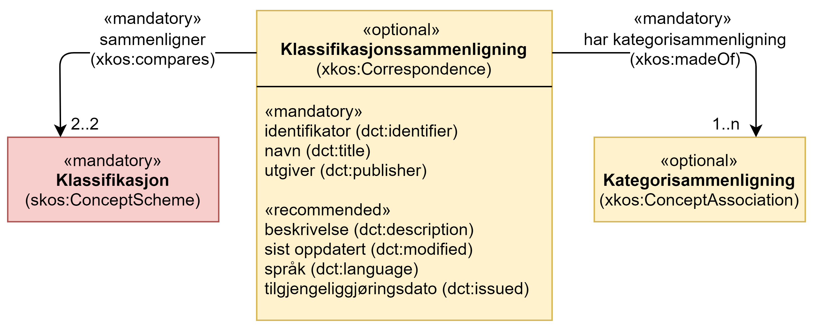

== Klassen Klassifikasjonssammenligning (xkos:Correspondence) [[Klassifikasjonssammenligning]]

[[img-KlassenKlassifikasjonssammenligning]]
.Klassen Klassifikasjonssammenligning (xkos:Correspondence) og klassene den refererer til.
[link=images/KlassenKlassifikasjonssammenligning.png]

[cols="30s,70d"]
|===
|English name |Correspondence
|Anvendelse / Usage note | (norsk) Klassen brukes til å representere sammenligning mellom to (varianter/versjoner av) klassifikasjoner, dvs. sammenstilling av sammenligninger mellom kategorier.

(English) This class is used to group concept associations between two classifications (concordances, correspondence tables ...).
|URI |xkos:Correspondence
|Kravnivå / Requirement level | Valgfri / Optional
|Eksempel |https://www.ssb.no/klass/klassifikasjoner/6/korrespondanser/111[«Klassifisering av informasjonssektoren 2007 - Næringsgruppering 2007 (SN 2007)»] er en sammenligning mellom «Klassifikasjon av informasjonssektor 2007» og «Næringsgruppering 2007 (SN2007)»
|===

Eksempel i RDF Turtle:
----
<https://www.ssb.no/klass/klassifikasjoner/6/korrespondanser/111> a xkos:Correspondence ; .
----

=== Obligatoriske egenskaper for klassen _Klassifikasjonssammenligning_ [[Klassifikasjonssammenligning-obligatoriske-egenskaper]]

==== Klassifikasjonssammenligning – har kategorisammenligning (xkos:madeOf) [[Klassifikasjonssammenligning-harKategorisammenligning]]

[cols="30s,70d"]
|===
|English name |made of
|URI |xkos:madeOf
|Range |xkos:ConceptAssociation
|Anvendelse / Usage note | (norsk) Egenskapen brukes til å referere til kategorisammenligning, dvs. sammenligning på kategorinivå.
|Usage note | (English) This property is used to group category correspondences that this correspondence is made of.
|Multiplisitet |1..n
|Kravnivå / Requirement level | Obligatorisk / Mandatory
|Eksempel | Klassifikasjonssammenligningen https://www.ssb.no/klass/klassifikasjoner/6/korrespondanser/111[«Klassifisering av informasjonssektoren 2007 - Næringsgruppering 2007 (SN 2007)»] inneholder bl.a. sammenligning mellom kategoriene «26.1 - Produksjon av elektroniske komponenter og kretskort» i «Standard for næringsgruppering (SN2007)» og «1.11 - Produksjon av elektroniske komponenter og kretskort» i «Klassifisering av informasjonssektoren 2007».
|===

Eksempel i RDF Turtle:
----
<https://www.ssb.no/klass/klassifikasjoner/6/korrespondanser/111> a xkos:Correspondence ;
   xkos:madeOf <261vs111> ; .

<261vs111> a xkos:ConceptAssociation ; .
----

[[Klassifikasjonssammenligning-identifikator]]
==== Klassifikasjonssammenligning – identifikator (dct:identifier) 

[cols="30s,70d"]
|===
|English name |identifier 
|URI |dct:identifier 
|Range |rdfs:Literal typed as xsd:anyURI 
|Anvendelse / Usage note | (norsk) Egenskapen brukes til å oppgi identifikatoren til sammenligningen. 

(English) This property is used to refer to the identifier of the correspondence.
|Multiplisitet |1..1 
|Kravnivå / Requirement level | Obligatorisk / Mandatory 
|Merknad / Note  1 | (norsk) Identifikator er som regel systemgenerert av verktøystøtte, slik at du som vanlig bruker ikke trenger å fylle ut verdien til denne egenskapen manuelt.

(norsk) For deg som skal utvikle/tilpasse verktøystøtte, se https://data.norge.no/guide/veileder-beskrivelse-av-datasett/#om-identifikator[Om identifikator (dct:identifer) i Veileder for beskrivelse av datasett osv.]

(Enligsh) See https://data.norge.no/guide/veileder-beskrivelse-av-datasett/#om-identifikator[Om identifikator (dct:identifer) i Veileder for beskrivelse av datasett osv.]
|Merknad / Note  2 | (norsk) Norsk utvidelse: ikke eksplisitt tatt med i XKOS. 

(English) Norwegian extension: not explicitly specified in XKOS.
|Eksempel |https://www.ssb.no/klass/klassifikasjoner/6/korrespondanser/111 er identifikator for klassifikasjonssammenligningen mellom «Klassifisering av informasjonssektoren 2007» og «Næringsgruppering 2007 (SN 2007)»
|===

[[Klassifikasjonssammenligning-navn]]
==== Klassifikasjonssammenligning – navn (dct:title) 

[cols="30s,70d"]
|===
|English name |name 
|URI |dct:title 
|Range |rdfs:Literal 
|Anvendelse / Usage note | (norsk) Egenskapen brukes til å oppgi navnet til sammenligningen. Egenskapen bør gjentas når navnet finnes i flere språk.  

(English) This property is used to specify the name of the correspondence, repeated when the name is in different languages. 
|Multiplisitet |1..n 
|Kravnivå / Requirement level | Obligatorisk / Mandatory 
|Merknad / Note  | (norsk) Norsk utvidelse: ikke eksplisitt tatt med i XKOS. 

(English) Norwegian extension: not explicitly specified in XKOS.
|Eksempel |«Klassifisering av informasjonssektoren 2007 - Næringsgruppering 2007 (SN 2007)» er navn på klassifikasjonssammenligningen https://www.ssb.no/klass/klassifikasjoner/6/korrespondanser/111
|===

Eksempel i RDF Turtle:
----
<https://www.ssb.no/klass/klassifikasjoner/6/korrespondanser/111> a xkos:Correspondence ;  
   dct:title "Klassifisering av informasjonssektoren 2007 - Næringsgruppering 2007 (SN 2007)"@nb ; .  
----

[[Klassifikasjonssammenligning-sammenligner]]
==== Klassifikasjonssammenligning – sammenligner (xkos:compares)

[cols="30s,70d"]
|===
|English name |compares
|URI |xkos:compares
|Range |skos:ConceptScheme
|Anvendelse / Usage note | (norsk) Egenskapen brukes til å referere til klassifikasjonene (eller versjonene/variantene av samme klassifikasjon) som det sammenlignes mellom.
|Usage note | (English) This property is used to link directly the xkos:Correspondence to the classification schemes that it puts in relation.
|Multiplisitet |2..2
|Kravnivå / Requirement level | Obligatorisk / Mandatory
|Eksempel |«Klassifisering av informasjonssektoren 2007» sammenlignes med «Næringsgruppering 2007 (SN2007)».
|===

Eksempel i RDF Turtle:
----
<https://www.ssb.no/klass/klassifikasjoner/6/korrespondanser/111> a xkos:Correspondence ;
   xkos:compares <sn2007> , <sn2007Infosektor> .

<sn2007> a skos:ConceptScheme ;
   skos:prefLabel "Næringsgruppering 2007 (SN 2007)"@nb ; .

<sn2007Infosektor> a skos:ConceptScheme ;
   skos:prefLabel "Klassifisering av informasjonssektoren 2007"@nb ; .
----

[[Klassifikasjonssammenligning-utgiver]]
==== Klassifikasjonssammenligning – utgiver (dct:publisher) 

[cols="30s,70d"]
|===
|English name |publisher 
|URI |dct:publisher 
|Range |foaf:Agent 
|Anvendelse / Usage note | (norsk) Egenskapen brukes til å referere til utgiver av sammenligningen.  

(English) This property is used to refer to the publisher of the corespondence.
|Multiplisitet |1..1 
|Kravnivå / Requirement level | Obligatorisk / Mandatory 
|Merknad / Note  |(norsk) Norsk utvidelse: ikke eksplisitt tatt med i XKOS.

(English) Norwegian extension: not explicitly specified in XKOS.
|Eksempel |Statistisk sentralbyrå (med org.nr. 971526920) er utgiver av klassifikasjonssammenligningen https://www.ssb.no/klass/klassifikasjoner/6/korrespondanser/111[«Klassifisering av informasjonssektoren 2007 - Næringsgruppering 2007 (SN 2007)»]. 
|===

Eksempel i RDF Turtle:
----
<https://www.ssb.no/klass/klassifikasjoner/6/korrespondanser/111> a xkos:Correspondence ;  
   dct:publisher <https://organization-catalog.fellesdatakatalog.digdir.no/organizations/971526920> ; . # Statistisk sentralbyrå 
----

=== Anbefalte egenskaper for klassen _Klassifikasjonssammenligning_ [[Klassifikasjonssammenligning-anbefalte-egenskaper]]

[[Klassifikasjonssammenligning-beskrivelse]]
==== Klassifikasjonssammenligning – beskrivelse (dct:description) 

[cols="30s,70d"]
|===
|English name |description 
|URI |dct:description 
|Range |rdfs:Literal 
|Anvendelse / Usage note | (norsk) Egenskapen brukes til å oppgi en kortfattet beskrivelse av sammenligningen. Egenskapen bør gjentas når beskrivelsen er i flere språk.  

(English) This property is used to give a short description of the correspondence, repeated when the description is in different languages.
|Multiplisitet |0..n 
|Kravnivå / Requirement level | Anbefalt / Recommended 
|Merknad / Note  |(norsk) Norsk utvidelse: ikke eksplisitt tatt med i XKOS.

(English) Norwegian extension: not explicitly specified in XKOS. 
|Eksempel |https://www.ssb.no/klass/klassifikasjoner/6/korrespondanser/109 med navn “Variant av SN - Miljøregnskap 2012 - Næringsgruppering 2007 (SN 2007)” har beskrivelse “Denne korrespondansetabellen viser korrespondansene på nivå 2 av miljøregnskapet (tilsvarer koden xx.xx)”
|===
 
Eksempel i RDF Turtle: 
----
<https://www.ssb.no/klass/klassifikasjoner/6/korrespondanser/109> a xkos:Correspondence ; 
  dct:description "Denne korrespondansetabellen viser korrespondansene på nivå 2 av miljøregnskapet (tilsvarer koden xx.xx)"@nb ; . 
----

[[Klassifikasjonssammenligning-sistOppdatert]]
==== Klassifikasjonssammenligning – sist oppdatert (dct:modified) 

[cols="30s,70d"]
|===
|English name |modified 
|URI |dct:modified 
|Range |rdfs:Literal typed as xsd:date or xsd:dateTime 
|Anvendelse / Usage note | (norsk) Egenskapen brukes til å oppgi dato/tidspunkt når sammenligningen sist ble oppdatert.  
(English) This property is used to specify the date or time when the correspondence was last modified. 
|Multiplisitet |0..1 
|Kravnivå / Requirement level | Anbefalt / Recommended 
|Merknad / Note  |(norsk) Norsk utvidelse: ikke eksplisitt tatt med i XKOS.

(English) Norwegian extension: not explicitly specified in XKOS. 
|Eksempel |https://www.ssb.no/klass/klassifikasjoner/6/korrespondanser/111[https://www.ssb.no/klass/klassifikasjoner/6/korrespondanser/111] var sist oppdatert 01.01.2009
|===
 
Eksempel i RDF Turtle: 
----
<https://www.ssb.no/klass/klassifikasjoner/6/korrespondanser/111> a xkos:Correspondence ;  
   dct:modified "2009-01-01"^^xsd:dateTime ; . 
----

[[Klassifikasjonssammenligning-språk]]
==== Klassifikasjonssammenligning – språk (dct:language) 

[cols="30s,70d"]
|===
|English name |language 
|URI |dct:language 
|Range |URI 
|Anvendelse / Usage note | (norsk) Egenskapen brukes til å oppgi språk som sammenligningen er utgitt i. 

(English) This property is used to specify the language(s) that the correspondence is in. 
|Multiplisitet |0..n 
|Kravnivå / Requirement level | Anbefalt / Recommended 
|Merknad / Note  1 | (norsk) Verdien skal hentes fra EUs kontrollerte liste over https://op.europa.eu/en/web/eu-vocabularies/concept-scheme/-/resource?uri=http://publications.europa.eu/resource/authority/language[Language]. 

(English) The value shall be chosen from EU's controlled vocabulary for https://op.europa.eu/en/web/eu-vocabularies/concept-scheme/-/resource?uri=http://publications.europa.eu/resource/authority/language[Language]. 
|Merknad / Note  2 | (norsk) Norsk utvidelse: ikke eksplisitt tatt med i XKOS.

(English) Norwegian extension: not explicitly specified in XKOS. 
|Eksempel |https://www.ssb.no/klass/klassifikasjoner/6/korrespondanser/111 finnes i NOB (bokmål), NNN (nynorsk) og ENG (engelsk)
|===
 
Eksempel i RDF Turtle: 
----
<https://www.ssb.no/klass/klassifikasjoner/6/korrespondanser/111> a xkos:Correspondence ;  
   dct:language 
      <https://publications.europa.eu/resource/authority/language/NOB>, # bokmål  
      <https://publications.europa.eu/resource/authority/language/NNN>, # nynorsk
      <https://publications.europa.eu/resource/authority/language/ENG>; # engelsk 
   . 
----

[[Klassifikasjonssammenligning-tilgjengeliggjøringsdato]]
==== Klassifikasjonssammenligning – tilgjengeliggjøringsdato (dct:issued) 

[cols="30s,70d"]
|===
|English name |issued 
|URI |dct:issued 
|Range |rdfs:Literal typed as xsd:date or xsd:dateTime 
|Anvendelse / Usage note | (norsk) Egenskapen brukes til å oppgi dato/tid når klassifikasjonen ble tilgjengeliggjort.  

(English) This property is used to specify the date/time when the classification was made accessible.
|Multiplisitet |0..1 
|Kravnivå / Requirement level | Anbefalt / Recommended 
|Merknad / Note | (norsk) Norsk utvidelse: ikke eksplisitt tatt med i XKOS.

(English) Norwegian extension: not explicitly specified in XKOS.
|Eksempel |https://www.ssb.no/klass/klassifikasjoner/6/korrespondanser/111 var tilgjengeliggjort 01.01.2009
|===
 
Eksempel i RDF Turtle: 
----
<https://www.ssb.no/klass/klassifikasjoner/6/korrespondanser/111> a xkos:Correspondence ;  
   dct:issued "2009-01-01"^^xsd:date ; .  
----
 
